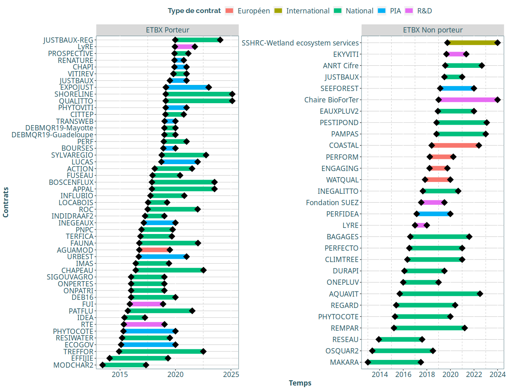

Traitement des données issues du document partagé pour l’Annexe 4
================

  - [Point du 24/07 sur les objectifs](#point-du-2407-sur-les-objectifs)
      - [Production de connaissances](#production-de-connaissances)
      - [Production “appliquée”](#production-appliquée)
      - [Production interdisciplinaire](#production-interdisciplinaire)
  - [Import et nettoyage des données](#import-et-nettoyage-des-données)
      - [Import](#import)
      - [Vision d’ensemble du fichier](#vision-densemble-du-fichier)
  - [Exploitation des données](#exploitation-des-données)
      - [Premiers indicateurs](#premiers-indicateurs)
          - [Projets](#projets)
          - [Volet “Production de
            connaissances”](#volet-production-de-connaissances)
      - [Vision pour chaque onglet](#vision-pour-chaque-onglet)

# Point du 24/07 sur les objectifs

**Objectif**: Définir des extractions pertinentes (indicateurs, Figures,
tableaux) pour alimenter la rédaction du rapport

Travail au niveau Global UR / dans un second temps par axe.

Plusieurs volets à exploiter :

## Production de connaissances

  - Articles (ACL ou non)
  - Chapitres d’ouvrages

## Production “appliquée”

  - Rapports scientifiques
  - Vulgarisation
  - Travail sur les partenaires économiques

## Production interdisciplinaire

  - Travail sur les co-publications au sein de l’UR (réseau?) et
    catégorisation manuelle des disciplines de chaque agent.
  - Travail sur les co-publications avec d’autres labos (les labos sont
    donc à catégoriser également)

> NB : Interdisciplinaire = SHS / SE / SPI

Objectif à court terme : Production d’indicateurs généraux, synthétiques
pour chaque onglet du document excel.

**Envoi le 24/07 d’un dernier mail de rappel pour demander l’ajout
d’articles qui seraient acceptés avec modifications mineures à ce jour
(et seulement mineures) et rappel pour les derniers retardataires. Ajout
d’une colonne ‘révision’ à cocher pour ces cas spécifiques. Cela
concerne publications + ouvrages.**

# Import et nettoyage des données

## Import

Dans un premier temps, chargement des packages nécessaires :

``` r
library(dplyr)
library(tidyr)
library(janitor)
library(ggplot2)
library(readxl)
library(purrr)
library(bib2df)

source("R/theme_inrae.R")
```

Nous pouvons maintenant importer le fichier :

``` r
# Fichier en date du 24/07/2020
file <- "data/Annexe4_ETBX_complet_2020_07_24.xlsx"


# On réalise une boucle pour importer tous les onglets dans un seul objet, sous forme de liste

sheet_names <- readxl::excel_sheets(file) 
ANX4 <- list()

for (i in sheet_names[-1:-3]) {
  
  ANX4[[i]] <- readxl::read_excel(file, sheet  = i, skip = 1) %>%
    select(-1) # Retrait colonne n°
  
}

# On rend exploitables les noms d'onglets
names(ANX4) <- janitor::make_clean_names(names(ANX4))
```

Pour les tableaux avec cases à cocher, on définit une fonction de
nettoyage qui permettra lors des synthèses de remplacer les `NA` par des
`0` et les `x` par des `1`. Ainsi, nous pourrons faire des sommes etc.

``` r
replace_cases <- function(x){
  
  value <- ifelse(is.na(x), yes = 0, no = 1)
  
  return(value)
  
}
```

## Vision d’ensemble du fichier

Voici un tableau récapitulatif de la dimension des onglets, triés selon
le nombre de lignes.

``` r
tab_dim <- tibble(
  Onglet = names(ANX4),
  nb_lignes = map_dbl(ANX4, nrow),
  nb_colonnes = map_dbl(ANX4, ncol)
) %>% 
  arrange(desc(nb_lignes))


# On ne va garder que les onglets qui ne sont pas vides. 
# Les onglets à 2 lignes sont à chaque fois vide (car la colonne n° a été remplie pour 1 et 2) 
# sauf pour 4 onglets particuliers qui sont ici rajoutés.
Onglets_non_empty <- tab_dim %>%
  filter(nb_lignes != 2) %>%
  pull(Onglet) %>% 
  c("ii_3_activ_consult","iii_1_elearning", "i_9_contrats_internationaux","i_1_articles_synth")

# On affiche le tableau
tab_dim %>% filter(Onglet %in% Onglets_non_empty)
```

<div class="kable-table">

| Onglet                                | nb\_lignes | nb\_colonnes |
| :------------------------------------ | ---------: | -----------: |
| i\_3\_autres\_produits\_colloq        |        139 |            5 |
| i\_1\_articles\_sctfq                 |        122 |            5 |
| ii\_3\_particip\_instances            |         84 |            3 |
| i\_8\_evaluation\_articles            |         82 |            3 |
| iii\_3\_enseignement                  |         53 |            8 |
| ii\_3\_rapports\_expertise            |         48 |            5 |
| i\_8\_responsab\_instances            |         46 |            5 |
| i\_3\_articles\_actes\_colloq         |         46 |            7 |
| iii\_3\_formation                     |         42 |            8 |
| i\_11\_orga\_colloq\_internat         |         41 |            4 |
| i\_9\_contrats\_nationaux             |         40 |           10 |
| i\_9\_contrats\_coll\_territ          |         34 |            9 |
| i\_2\_chap\_ouvrages                  |         34 |            5 |
| iii\_2\_prod\_issues\_de\_theses      |         28 |            8 |
| ii\_4\_produits\_vulgarisation        |         27 |            5 |
| i\_8\_evaluation\_projets             |         22 |            3 |
| i\_9\_contrats\_pia                   |         18 |            9 |
| i\_7\_comites\_editoriaux             |         15 |            2 |
| i\_1\_autres\_articles                |         15 |            5 |
| i\_5\_questionnaires                  |         13 |            8 |
| i\_10\_post\_docs                     |         11 |            9 |
| ii\_4\_emissions\_radio\_tv           |         10 |            5 |
| ii\_2\_formations\_acteurs\_socioec   |          9 |            5 |
| i\_10\_chercheurs\_accueil            |          8 |            9 |
| i\_4\_logiciels                       |          8 |            5 |
| i\_11\_responsab\_stes\_savantes      |          7 |            3 |
| i\_9\_contrats\_prive\_r\_d\_indus    |          7 |            9 |
| i\_11\_sejours\_labo\_etrangers       |          6 |            4 |
| iii\_3\_respons\_master               |          6 |            5 |
| i\_9\_contrats\_europ\_autres         |          6 |            9 |
| i\_11\_prix\_distictions              |          5 |            3 |
| ii\_2\_creation\_reseaux              |          5 |            5 |
| i\_11\_invit\_colloq\_etranger        |          4 |            3 |
| i\_6\_produits\_propres\_a\_une\_disc |          4 |            4 |
| ii\_2\_contrats\_r\_d                 |          4 |            5 |
| i\_2\_monographies                    |          3 |            5 |
| ii\_3\_activ\_consult                 |          2 |            2 |
| i\_1\_articles\_synth                 |          2 |            5 |
| iii\_1\_elearning                     |          1 |            8 |
| ii\_2\_bourses\_cifre                 |          1 |            4 |
| i\_9\_contrats\_internationaux        |          1 |            9 |
| i\_4\_bases\_de\_donnees              |          1 |            4 |
| i\_4\_outils\_aide\_decision          |          1 |            4 |
| i\_2\_theses\_publiees                |          1 |            4 |
| i\_2\_dir\_ou\_coord                  |          1 |            5 |

</div>

# Exploitation des données

## Premiers indicateurs

### Projets

``` r
## Extraction des projets nationaux
projets_nationaux <- ANX4$i_9_contrats_nationaux %>% 
  clean_names() %>% 
  select(-x11) %>% 
  drop_na(contrat) %>% drop_na(date_debut) %>% mutate(type = "National")

## Projets européens
projets_europ <- ANX4$i_9_contrats_europ_autres %>% drop_na(`Date début`) %>% clean_names() %>%  
  mutate_at(vars(date_debut:date_fin), as.Date) %>% mutate(type = "Européen")

## Projets internationaux
projets_inter <- ANX4$i_9_contrats_internationaux %>% clean_names() %>%  
  mutate_at(vars(date_debut:date_fin), as.Date) %>% mutate(type = "International")

## Projets R&D
projets_rd <- ANX4$i_9_contrats_prive_r_d_indus %>% clean_names() %>%  
  mutate_at(vars(date_debut:date_fin), as.Date) %>% mutate(type = "R&D")

## Projets PIA
projets_pia <- ANX4$i_9_contrats_pia %>% clean_names() %>%  drop_na(contrat,date_debut) %>% 
  mutate_at(vars(date_debut:date_fin), as.Date) %>% mutate(type = "PIA")

## Projets de collectivités territoriales
projets_coll_terri <- ANX4$i_9_contrats_coll_territ %>% clean_names() %>%  drop_na(contrat,date_debut, date_fin) %>% 
  mutate_at(vars(date_debut), as.Date, origin = "1899-12-31") %>% mutate(type = "Collect. Ter.")

## On assemble le tout
PRJ <- bind_rows(projets_nationaux,projets_europ)%>%
  bind_rows(projets_inter) %>% 
  bind_rows(projets_rd) %>% 
  bind_rows(projets_pia) %>% 
  bind_rows(projets_coll_terri) %>% 
  mutate_at(vars(porteur:axe_3), replace_cases) %>% unique() %>% 
  mutate(date_fin = replace_na(date_fin, "2024-01-01")) %>%  # Il y a un projet international (le seul) à la fin inconnue... Donc par défaut j'ai décidé la fin en 2024 pour ne pas changer la tête du graphique tout en conservant l'info qu'il y a un projet international.
  mutate(porteur = recode(porteur, "0" = "ETBX Non porteur", "1"="ETBX Porteur")) %>% 
  mutate(porteur = factor(porteur, levels = c("ETBX Porteur", "ETBX Non porteur")))

## Production du graphique
ggplot(PRJ, aes(x = date_fin, y = contrat)) +
  geom_segment(aes(x = date_debut, xend = date_fin, y = contrat, yend = contrat, color = type), size = 4) +
  geom_point(fill = "black", shape = 23, color = "black", size = 4) +
  geom_point(aes(x = date_debut, y = contrat), color ="black", fill = "black", shape = 23, size = 4) +
  theme_inrae() +
  geom_vline(xintercept = as.Date("2020-06-01"), color = "blue", size = 4) +
  labs(x = "Temps", y = "Contrats", color = "Type") +
  facet_wrap(~porteur, scales = "free")
```



### Volet “Production de connaissances”

Problème rencontré : La saisie manuelle par les collègues sur le fichier
excel ne permet pas d’effectuer de requêtes intéressantes… Il faut donc
extraire manuellement auteur / date / revue sur des colonnes
supplémentaires. Ci-dessous j’ai également tenté une approche via la
base HALINRAE.

``` r
# J'ai testé un export massif HAL-INRAE avec dates 2017-2020 et structure ETBX
test <- bib2df::bib2df("~/biball.bib")
```

## Vision pour chaque onglet

\[TO-DO\]
