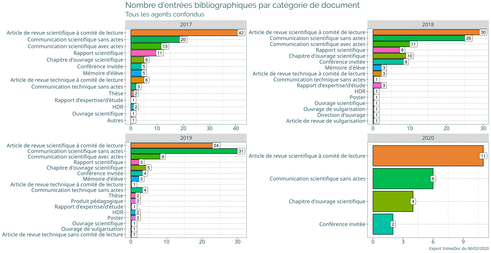
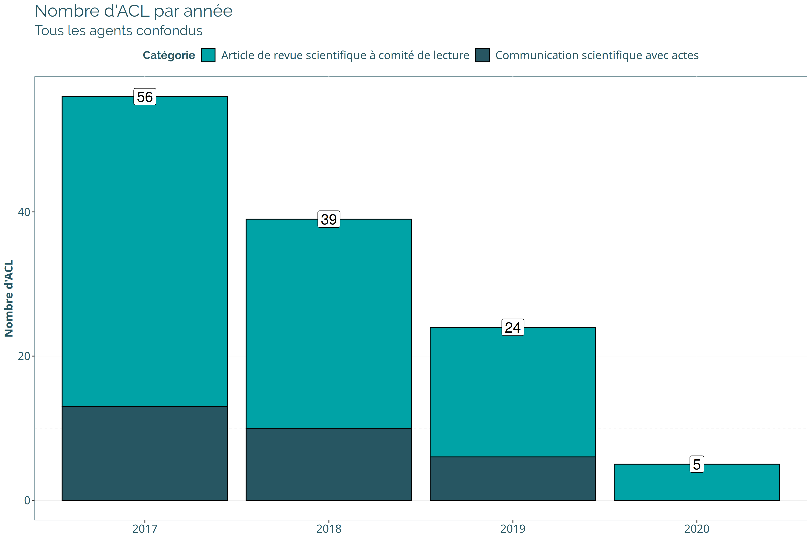
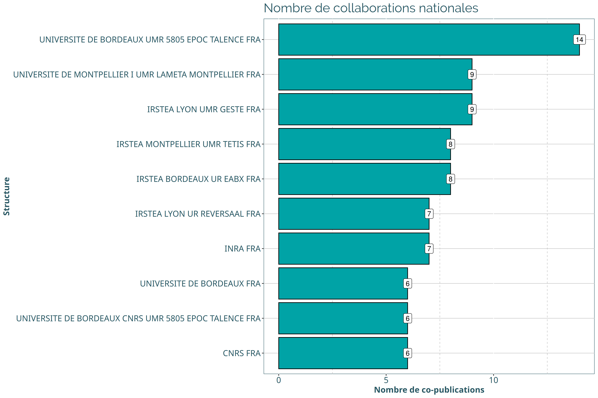
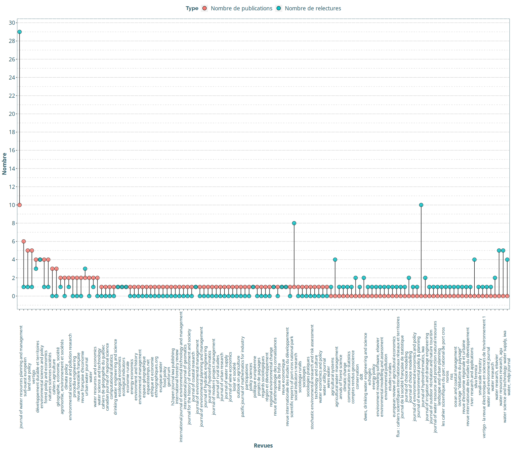
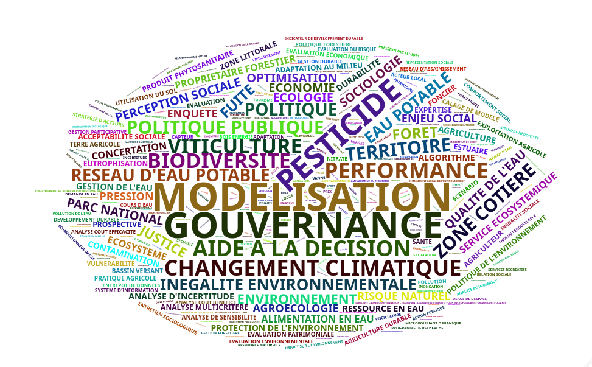

  - [Statistiques ETBX pour l’HCERES
    2020](#statistiques-etbx-pour-lhceres-2020)
  - [Initialisation et import des
    données](#initialisation-et-import-des-données)
  - [Barplot général de toutes les
    entrées](#barplot-général-de-toutes-les-entrées)
  - [Nombre d’Article à Comité de Lecture (ACL) par
    année.](#nombre-darticle-à-comité-de-lecture-acl-par-année.)
  - [Sélection des auteurs ETBX](#sélection-des-auteurs-etbx)
  - [Récupération de données
    bibliométriques](#récupération-de-données-bibliométriques)
      - [Construction de la base de
        DOIs](#construction-de-la-base-de-dois)
      - [Requête SCOPUS](#requête-scopus)
      - [Analyse du nombre de
        citations](#analyse-du-nombre-de-citations)
  - [Collaborations](#collaborations)
      - [National](#national)
      - [International](#international)
  - [Analyse des mots clés](#analyse-des-mots-clés)

# Statistiques ETBX pour l’HCERES 2020

# Initialisation et import des données

``` r
## Manipulation de données
library(tidyverse)
library(purrr)
library(igraph)
library(wordcloud2)
library(here)


## Package pour l'import de .bib
library(bib2df)
library(bibliometrix)

## Thème INRAE
source(here("R","theme_inrae.R"))
```

``` r
# Liste des fichiers bib irsteadoc
list_bib <- list.files(here(),pattern = "\\.bib$")[-1] # Pour ne pas prendre biball

# Import et mise en tableau
bib_df <- purrr::map_df(list_bib,bib2df::bib2df)
```

# Barplot général de toutes les entrées

``` r
plot_general <- bib_df %>% select(NOTE, AUTHOR, TITLE, YEAR) %>% 
  unnest(AUTHOR) %>% 
  group_by(YEAR,NOTE) %>% 
  summarise(n = n_distinct(TITLE)) %>% 
  ungroup() %>% 
  arrange(desc(n)) %>% 
  
ggplot(aes(x = reorder(NOTE, n), y = n)) +
  geom_col(color = "black", aes(fill = NOTE))+
  geom_label(aes(label = n)) +
  facet_wrap(~YEAR, scales = "free") +
  guides(fill = FALSE) +
  coord_flip() +
  theme_inrae() +
  labs(title = "Nombre d'entrées bibliographiques par catégorie de document", subtitle = "Tous les agents confondus", caption = "Export IrsteaDoc du 16/03/2020") +
  theme(axis.title = element_blank()) 

plot_general
```



> TO-DO: Idem mais “chercheurs” uniquement

# Nombre d’Article à Comité de Lecture (ACL) par année.

``` r
plot_ACL <- bib_df %>% select(NOTE, AUTHOR, TITLE, YEAR) %>% 
  unnest(AUTHOR) %>% 
  group_by(YEAR, NOTE) %>%
  filter(NOTE %in% c("Article de revue scientifique à comité de lecture","Communication scientifique avec actes")) %>% 
  summarise(n = n_distinct(TITLE)) %>% 
  mutate(n_publi = sum(n)) %>% 
  ungroup() %>% 
  arrange(YEAR) %>% 
  mutate(YEAR = as.character(YEAR)) %>% 
  
  ggplot(aes(x = YEAR, y = n)) +
  geom_col(color = "black", aes(fill = NOTE))+
  geom_label(aes(y = n_publi,label = n_publi), size = 6) +
  scale_fill_inrae(name = "Catégorie")+
  theme_inrae() +
  theme(axis.title.x = element_blank())+
  labs(title = "Nombre d'ACL par année", subtitle = "Tous les agents confondus", y = "Nombre d'ACL")

plot_ACL
```



> TO-DO: Idem mais “chercheurs” uniquement

# Sélection des auteurs ETBX

> TODO : Attention il faudra regrouper manuellement certains noms
> composés … Adeline Alonso-Ugaglia par exemple de BSA y est 2 fois (et
> ça a sûrement pu arriver pour des gens d’ETBX). Dans ce cas là, les
> noter et on fusionnera ici ces noms avant de faire des stats/graphes.

# Récupération de données bibliométriques

Les données telles que le nombre de citations ne sont pas présentes dans
l’export IrsteaDoc. Il faut donc chercher ces informations par une
requête sur les principaux moteurs de recherche dédiés. Scopus a fourni
le plus de résultats avec 58 retours basés sur le DOI. Environ 40 infos
de citation ont également été récupérées manuellement via google
scholar.

## Construction de la base de DOIs

``` r
## J'ai retrouvé quelques DOI à la main
complement_doi <- read_csv2("complement_doi.csv")

## Ces 16 entrées ne sont que dans HAL (aucune info citation)
doi_hal <- complement_doi %>% filter(str_detect(DOI,"hal-"))

## Ces entrées ont un DOI OK à ajouter
doi_ok <- complement_doi %>% filter(str_detect(DOI,"10.")) %>% select(-citations)

## Ces entrées n'ont pas de DOI mais j'ai relevé quand c'était possible leur nombre de citations
citations <- complement_doi %>% filter(!is.na(citations)) %>% rename(nb_citations=citations) %>% 
  select(BIBTEXKEY,nb_citations)

base_doi <- bib_df %>% 
  filter(NOTE %in% c("Article de revue scientifique à comité de lecture","Communication scientifique avec actes")) %>% 
  select(BIBTEXKEY,AUTHOR,TITLE,DOI) %>% 
  mutate(DOI = str_remove_all(DOI,"http://dx.doi.org/")) %>%
  filter(!BIBTEXKEY %in% doi_ok$BIBTEXKEY) %>%
  bind_rows(doi_ok) %>% drop_na(DOI)
```

## Requête SCOPUS

``` r
## Voici la requête à effectuer sur Scopus > Advanced
Scopus_Request <- base_doi %>% 
  mutate(request = paste0("DOI(",DOI,")")) %>% 
  pull(request) %>% 
  paste0(collapse = " OR ")

## On lit l'export Scopus

scopus_data_raw <- bibliometrix::readFiles("bdd_biblio/scopus_doi.bib") %>% 
  bibliometrix::convert2df(dbsource = "scopus", format = "bibtex")
```

    ## 
    ## Converting your scopus collection into a bibliographic dataframe
    ## 
    ## Articles extracted   58 
    ## Done!
    ## 
    ## 
    ## Generating affiliation field tag AU_UN from C1:  Done!

``` r
scopus_data <- scopus_data_raw  %>% tbl_df() %>% 
  select(DOI = DI,nb_citations = TC) %>%
  arrange(desc(nb_citations))

## On refait la jointure avec les données initiales, et on ajoute les données de citation
new_bib_df <- scopus_data %>%
  mutate(DOI = tolower(DOI)) %>%
  inner_join(base_doi %>% mutate(DOI = tolower(DOI)), by = "DOI") %>%
  select(BIBTEXKEY,nb_citations) %>%
  bind_rows(citations) %>% 
  full_join(bib_df, by = "BIBTEXKEY") %>% 
  unique()
```

Nous avons récupé des information bibliométriques Scopus (dont les
citations) pour 94 ACL / 125.

## Analyse du nombre de citations

``` r
nb_citations_an <- new_bib_df %>% group_by(YEAR) %>% summarise(nb_citations = sum(nb_citations,na.rm=TRUE))
nb_citations_an
```

<div class="kable-table">

| YEAR | nb\_citations |
| ---: | ------------: |
| 2017 |           137 |
| 2018 |            78 |
| 2019 |            26 |
| 2020 |             1 |

</div>

``` r
# On enlève 2020 car plombe le résultat.
nb_moy_citation_an <- mean(nb_citations_an$nb_citations[-4]) 
nb_moy_citation_an
```

    ## [1] 80.33333

On a donc 80 citations en moyenne par an sur la base de 94 documents
parmi les 125 recensés ACL (sur 2017-2019). En toute logique, les
articles publiés en 2017 ont été cités plus de fois (car plus nombreux,
et surtout plus anciens).

# Collaborations

## National

``` r
vec_affiliations <- new_bib_df %>%
  select(AFFILIATION) %>% 
  mutate(delinked = str_split(AFFILIATION, " ; ")) %>% 
  pull(delinked) %>%
  unlist() 

links <- tibble(origin = "INRAE BORDEAUX UR ETBX FRA", collab = vec_affiliations) %>% 
  filter(!collab %in% c("IRSTEA BORDEAUX UR ETBX FRA","INRAE BORDEAUX UR ETBX FRA")) %>% 
  mutate(origin_country = str_sub(origin, start= -3)) %>% 
  mutate(collab_country = str_sub(collab, start= -3)) %>% 
  filter(collab_country == "FRA") %>% 
  select(-origin_country,-collab_country) %>% 
  group_by(origin) %>% 
  count(collab) %>%
  ungroup() 
```

``` r
n_distinct(links$collab)
```

    ## [1] 176

> **ETBX a co-publié avec 176 structures françaises différentes.**

Visualisation des 10 structures françaises avec lesquelles ETBX
collabore le plus :

``` r
collab_10_FRA <- links %>%
  arrange(desc(n)) %>%
  slice(1:10) %>% 

ggplot(aes(x = reorder(collab,n), y = n)) +
  geom_col(fill = "#00a3a6", color ="black") +
  geom_label(aes(label = n)) +
  coord_flip() +
  theme_inrae() +
  labs(y = "Nombre de co-publications", x = "Structure", title = "Nombre de collaborations nationales")

collab_10_FRA
```



## International

``` r
vec_affiliations <- new_bib_df %>%
  filter(NOTE %in% c("Article de revue scientifique à comité de lecture","Communication scientifique avec actes")) %>% 
  select(AFFILIATION) %>% 
  mutate(delinked = str_split(AFFILIATION, " ; ")) %>% 
  pull(delinked) %>%
  unlist() 

links <- tibble(origin = "INRAE BORDEAUX UR ETBX FRA", collab = vec_affiliations) %>% 
  filter(!collab %in% c("IRSTEA BORDEAUX UR ETBX FRA","INRAE BORDEAUX UR ETBX FRA")) %>% 
  mutate(origin_country = str_sub(origin, start= -3)) %>% 
  mutate(collab_country = str_sub(collab, start= -3)) %>% 
  mutate(collab_country = toupper(collab_country)) %>% 
  group_by(origin_country) %>% 
  count(collab_country) %>%
  ungroup() %>%
  select(origin_country,collab_country,importance=n) %>% 
  filter(!collab_country %in% c("FRA","-")) %>% 
  mutate(origin_country = recode(origin_country,"FRA"="ETBX")) 
```

``` r
n_distinct(links$collab_country)
```

    ## [1] 43

> **ETBX a co-publié avec 43 pays différents.**

Visualisation des 10 pays avec lesquels ETBX collabore le plus :

``` r
collab_10_INT <- links %>%
  arrange(desc(importance)) %>%
  slice(1:10) %>% 

ggplot(aes(x = reorder(collab_country,importance), y = importance)) +
  geom_col(fill = "#00a3a6", color ="black") +
  geom_label(aes(label = importance)) +
  coord_flip() +
  theme_inrae() +
  labs(y = "Nombre de co-publications", x = "Pays", title = "Top 10 des pays collaborateurs")

collab_10_INT
```



# Analyse des mots clés

``` r
vec_keywords <- bib_df %>% unique() %>% 
  select(KEYWORDS) %>%
  mutate(KEYWORDS = str_split(KEYWORDS," ; ")) %>% 
  pull(KEYWORDS) %>%
  unlist()

word_count <- tibble(keyword = vec_keywords) %>% 
  count(keyword) %>% 
  arrange(desc(n))

wd <- wordcloud2(word_count,size = 0.5)
```


