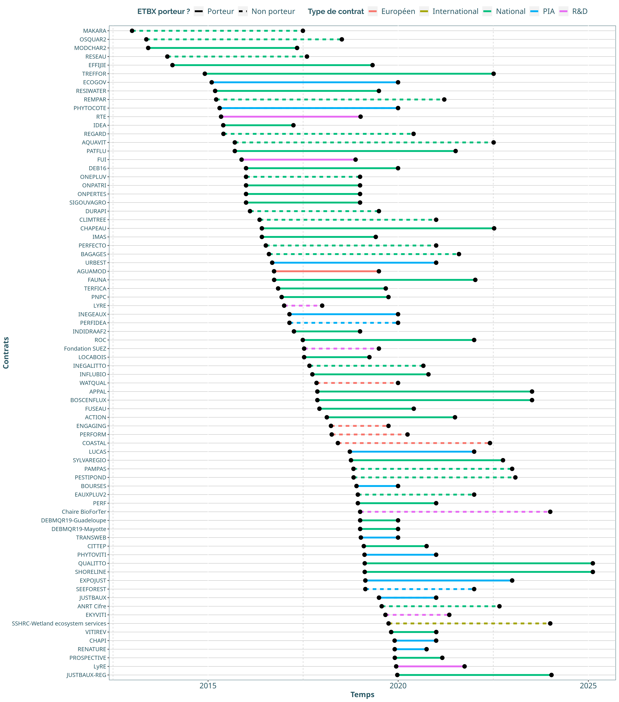
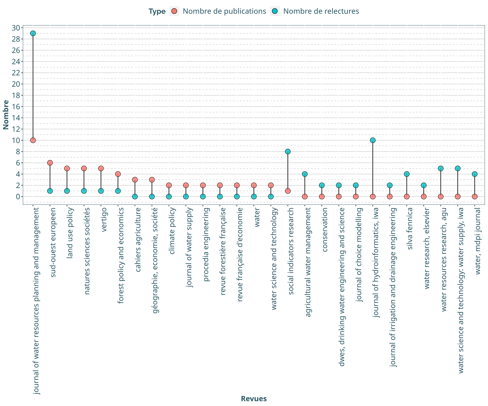
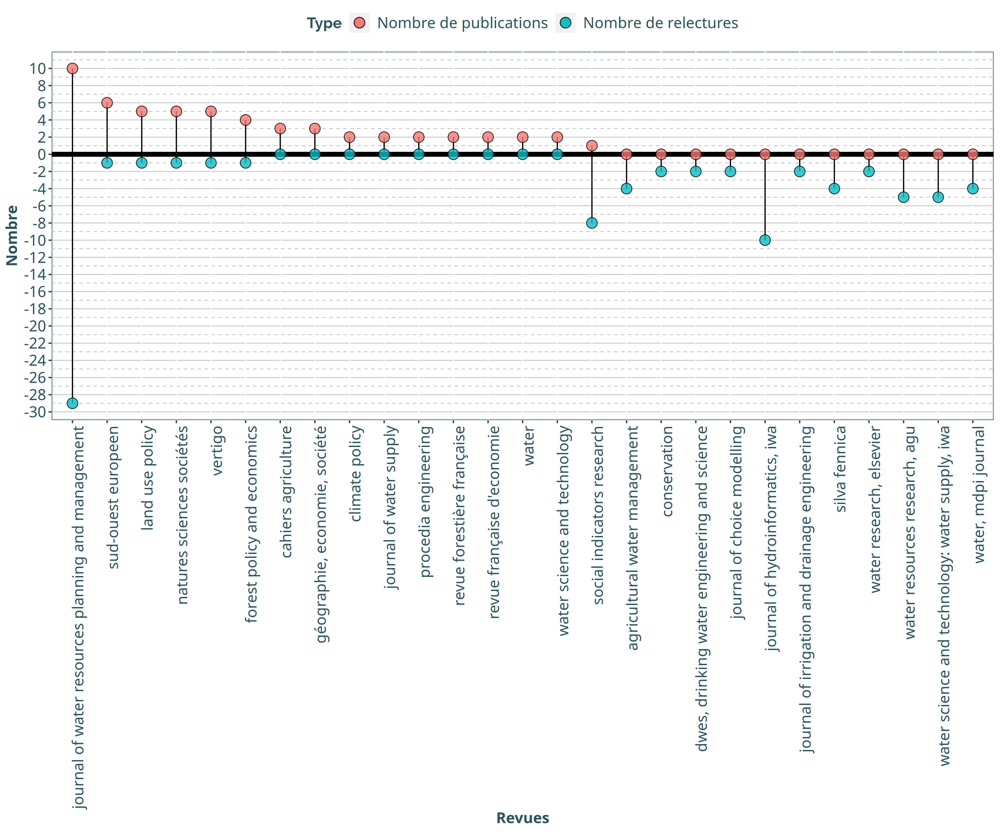
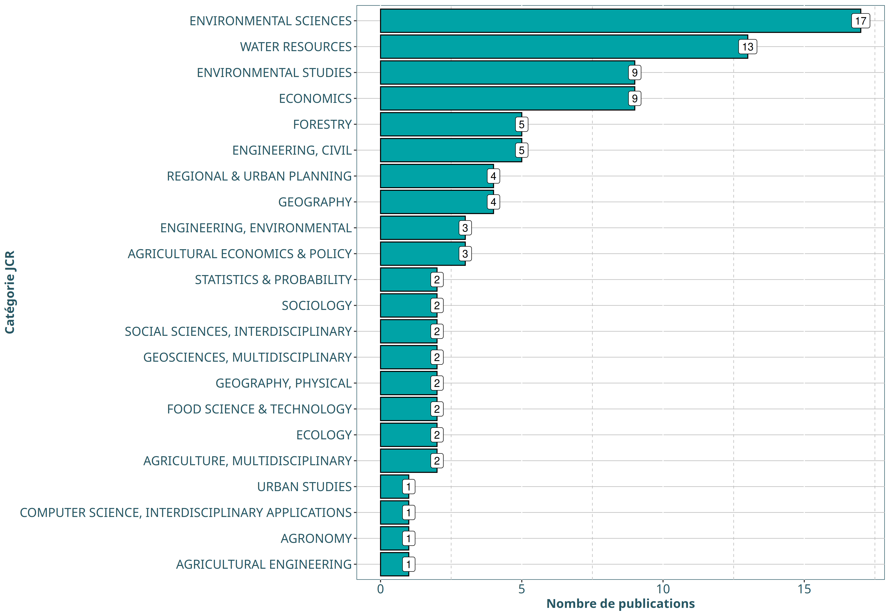
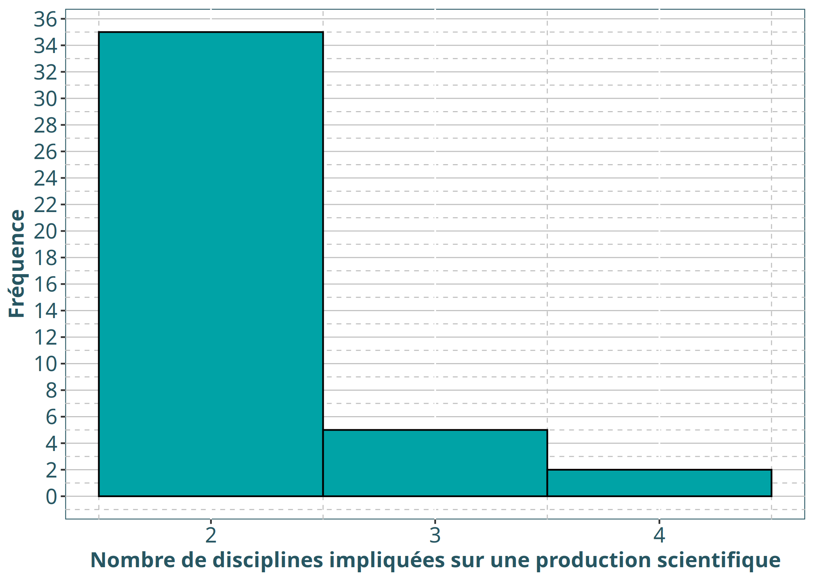

Traitement des données issues du document partagé pour l’Annexe 4
================

  - [Point du 24/07 sur les objectifs](#point-du-2407-sur-les-objectifs)
      - [Vision d’ensemble du fichier](#vision-densemble-du-fichier)
  - [Exploitation des données](#exploitation-des-données)
      - [Premiers indicateurs](#premiers-indicateurs)
          - [Projets](#projets)
          - [Production de connaissances](#production-de-connaissances)
              - [Quantification de la
                production](#quantification-de-la-production)
              - [Revues scientifiques](#revues-scientifiques)
              - [Nombre de citations](#nombre-de-citations)
          - [Partenariats](#partenariats)
              - [Interdisciplinarité proche
                (interne)](#interdisciplinarité-proche-interne)
              - [Interdisciplinarité éloignée
                (externe)](#interdisciplinarité-éloignée-externe)
      - [Reste à faire](#reste-à-faire)

# Point du 24/07 sur les objectifs

**Objectif**: Définir des extractions pertinentes (indicateurs, Figures,
tableaux) pour alimenter la rédaction du rapport

Travail au niveau Global UR / dans un second temps par axe.

Plusieurs volets à exploiter :

  - **Production de connaissances**
    
      - Articles (ACL ou non)
      - Chapitres d’ouvrages
      - Identification dans les revues

  - **Production “appliquée”**
    
      - Rapports scientifiques
      - Vulgarisation
      - Travail sur les partenaires économiques

  - **Partenariats**
    
      - Travail sur les co-publications au sein de l’UR (réseau?) et
        catégorisation manuelle des disciplines de chaque agent.
      - Travail sur les co-publications avec d’autres labos (les labos
        sont donc à catégoriser également)

> NB : Interdisciplinaire = SHS / SE / SPI

Objectif à court terme : Production d’indicateurs généraux, synthétiques
pour chaque onglet du document excel.

**Envoi le 24/07 d’un dernier mail de rappel pour demander l’ajout
d’articles qui seraient acceptés avec modifications mineures à ce jour
(et seulement mineures) et rappel pour les derniers retardataires. Ajout
d’une colonne ‘révision’ à cocher pour ces cas spécifiques. Cela
concerne publications + ouvrages.**

``` r
library(dplyr)
library(tidyr)
library(lubridate)
library(janitor)
library(ggplot2)
library(readxl)
library(purrr)
library(bib2df)
library(wordcloud2)
library(stringr)
library(readr)

source("R/theme_inrae.R")
```

``` r
# Fichier en date du 03/08/2020
file <- "data/Annexe4_ETBX_complet_2020_08_03.xlsx"


# On réalise une boucle pour importer tous les onglets dans un seul objet, sous forme de liste

sheet_names <- readxl::excel_sheets(file)
ANX4 <- list()

for (i in sheet_names[-1:-3]) {
  ANX4[[i]] <- readxl::read_excel(file, sheet = i, skip = 1) %>%
    select(-1) # Retrait colonne n°
}

# On rend exploitables les noms d'onglets
names(ANX4) <- janitor::make_clean_names(names(ANX4))
```

``` r
replace_cases <- function(x) {
  value <- ifelse(is.na(x), yes = 0, no = 1)

  return(value)
}
```

## Vision d’ensemble du fichier

Voici un tableau récapitulatif de la dimension des onglets, triés selon
le nombre de lignes (on ne présente ici que les 10 onglets contenants le
plus de lignes).

``` r
tab_dim <- tibble(
  Onglet = names(ANX4),
  nb_lignes = map_dbl(ANX4, nrow),
  nb_colonnes = map_dbl(ANX4, ncol)
) %>%
  arrange(desc(nb_lignes))


# On ne va garder que les onglets qui ne sont pas vides.
# Les onglets à 2 lignes sont à chaque fois vide (car la colonne n° a été remplie pour 1 et 2)
# sauf pour 4 onglets particuliers qui sont ici rajoutés.
Onglets_non_empty <- tab_dim %>%
  filter(nb_lignes != 2) %>%
  pull(Onglet) %>%
  c("ii_3_activ_consult", "iii_1_elearning", "i_9_contrats_internationaux", "i_1_articles_synth")

# On affiche le tableau (Seulement le top 10)
tab_dim %>%
  filter(Onglet %in% Onglets_non_empty) %>%
  slice(1:10)
```

<div class="kable-table">

| Onglet                         | nb\_lignes | nb\_colonnes |
| :----------------------------- | ---------: | -----------: |
| i\_3\_autres\_produits\_colloq |        136 |            6 |
| i\_1\_articles\_sctfq          |        125 |            7 |
| ii\_3\_particip\_instances     |         86 |            3 |
| i\_8\_evaluation\_articles     |         83 |            3 |
| iii\_3\_enseignement           |         53 |            8 |
| ii\_3\_rapports\_expertise     |         48 |            6 |
| i\_8\_responsab\_instances     |         46 |            5 |
| i\_3\_articles\_actes\_colloq  |         46 |            7 |
| i\_2\_chap\_ouvrages           |         44 |            6 |
| iii\_3\_formation              |         42 |            8 |

</div>

# Exploitation des données

## Premiers indicateurs

### Projets

> **NB : Il y a un projet international (le seul) à la fin inconnue…
> Donc par défaut j’ai décidé la fin en 2024 pour ne pas changer la tête
> du graphique tout en conservant l’info qu’il y a un projet
> international.**

``` r
## Extraction des projets nationaux
projets_nationaux <- ANX4$i_9_contrats_nationaux %>%
  clean_names() %>%
  select(-x11) %>%
  drop_na(contrat) %>%
  drop_na(date_debut) %>%
  mutate(type = "National")

## Projets européens
projets_europ <- ANX4$i_9_contrats_europ_autres %>%
  drop_na(`Date début`) %>%
  clean_names() %>%
  mutate_at(vars(date_debut:date_fin), as.Date) %>%
  mutate(type = "Européen")

## Projets internationaux
projets_inter <- ANX4$i_9_contrats_internationaux %>%
  clean_names() %>%
  mutate_at(vars(date_debut:date_fin), as.Date) %>%
  mutate(type = "International")

## Projets R&D
projets_rd <- ANX4$i_9_contrats_prive_r_d_indus %>%
  clean_names() %>%
  mutate_at(vars(date_debut:date_fin), as.Date) %>%
  mutate(type = "R&D")

## Projets PIA
projets_pia <- ANX4$i_9_contrats_pia %>%
  clean_names() %>%
  drop_na(contrat, date_debut) %>%
  mutate_at(vars(date_debut:date_fin), as.Date) %>%
  mutate(type = "PIA")

## Projets de collectivités territoriales
projets_coll_terri <- ANX4$i_9_contrats_coll_territ %>%
  clean_names() %>%
  drop_na(contrat, date_debut, date_fin) %>%
  mutate_at(vars(date_debut), as.Date, origin = "1899-12-31") %>%
  mutate(type = "National")

## On assemble le tout
PRJ <- bind_rows(projets_nationaux, projets_europ) %>%
  bind_rows(projets_inter) %>%
  bind_rows(projets_rd) %>%
  bind_rows(projets_pia) %>%
  bind_rows(projets_coll_terri) %>%
  mutate_at(vars(porteur:axe_3), replace_cases) %>%
  unique() %>%
  mutate(date_fin = replace_na(date_fin, "2024-01-01")) %>%
  mutate(porteur = recode(porteur, "0" = "Non porteur", "1" = "Porteur")) %>%
  mutate(porteur = factor(porteur, levels = c("Porteur", "Non porteur"))) %>%
  group_by(contrat) %>%
  summarise(
    date_debut = min(date_debut),
    date_fin = max(date_fin),
    porteur = unique(porteur),
    type = unique(type)
  ) %>%
  ungroup() %>%
  arrange(date_debut) %>%
  mutate(contrat = factor(contrat, levels = unique(contrat)))
```

Nous pouvons dans un premier temps représenter graphiquement la
chronologie des contrats :

``` r
ggplot(PRJ, aes(x = date_fin, y = contrat)) +
  geom_segment(aes(x = date_debut, xend = date_fin, y = contrat, yend = contrat, color = type, linetype = porteur), size = 1.5) +
  scale_y_discrete(limits = rev(levels(PRJ$contrat))) +
  geom_point(fill = "black", color = "black", size = 3) +
  geom_point(aes(x = date_debut, y = contrat), color = "black", fill = "black", size = 3) +
  theme_inrae() +
  theme(axis.text.y = element_text(size = 10)) +
  geom_vline(xintercept = as.Date("2020-06-01"), color = "blue", size = 4) +
  labs(x = "Temps", y = "Contrats", color = "Type de contrat", linetype = "ETBX porteur ?")
```



Nous pouvons aussi compter combien de contrats **commencent** chaque
année (NB: et qui sont encore en cours sur la période 2017-2020, les
contrats qui débutent avant 2017 mais qui ont pris fin avant 2017 ne
sont pas comptabilisés).

``` r
PRJ %>%
  mutate(
    annee_debut = lubridate::year(date_debut),
    annee_fin = lubridate::year(date_fin)
  ) %>%
  group_by(annee_debut) %>%
  count(type) %>%
  spread(key = annee_debut, value = n) %>%
  ungroup() %>%
  mutate_at(vars(`2013`:`2019`), replace_na, 0)
```

<div class="kable-table">

| type          | 2013 | 2014 | 2015 | 2016 | 2017 | 2018 | 2019 |
| :------------ | ---: | ---: | ---: | ---: | ---: | ---: | ---: |
| Européen      |    0 |    0 |    0 |    1 |    1 |    3 |    0 |
| International |    0 |    0 |    0 |    0 |    0 |    0 |    1 |
| National      |    4 |    2 |    7 |   14 |    8 |    6 |   11 |
| PIA           |    0 |    0 |    2 |    1 |    2 |    2 |    8 |
| R\&D          |    0 |    0 |    2 |    0 |    2 |    0 |    3 |

</div>

Et combien **finissent** chaque année, à partir de 2017 :

``` r
PRJ %>%
  mutate(
    annee_debut = lubridate::year(date_debut),
    annee_fin = lubridate::year(date_fin)
  ) %>%
  group_by(annee_fin) %>%
  count(type) %>%
  spread(key = annee_fin, value = n) %>%
  ungroup() %>%
  mutate_at(vars(`2017`:`2025`), replace_na, 0)
```

<div class="kable-table">

| type          | 2017 | 2018 | 2019 | 2020 | 2021 | 2022 | 2023 | 2024 | 2025 |
| :------------ | ---: | ---: | ---: | ---: | ---: | ---: | ---: | ---: | ---: |
| Européen      |    0 |    0 |    3 |    1 |    0 |    1 |    0 |    0 |    0 |
| International |    0 |    0 |    0 |    0 |    0 |    0 |    1 |    0 |    0 |
| National      |    4 |    6 |   11 |    9 |    8 |    8 |    3 |    1 |    2 |
| PIA           |    0 |    0 |    6 |    5 |    3 |    1 |    0 |    0 |    0 |
| R\&D          |    0 |    2 |    2 |    0 |    2 |    0 |    0 |    1 |    0 |

</div>

Nous pouvons enfin quantifier, chaque année, combien de projets sont
**en cours** (NB: Pour les années antérieures à 2017, seuls les contrats
prenant fin à partir de 2017 sont comptabilisés).

``` r
par_an <- PRJ %>%
  mutate(
    annee_debut = lubridate::year(date_debut),
    annee_fin = lubridate::year(date_fin)
  )

l <- list()

for (i in 2014:2020) {
  l[[as.character(i)]] <- par_an %>%
    filter(annee_debut <= i & annee_fin >= i) %>%
    mutate(an = i)
}


count_type <- function(df) {
  df %>%
    group_by(type, an) %>%
    count() %>%
    arrange(desc(n))
}


map(l, count_type) %>%
  bind_rows() %>%
  spread(key = an, value = n) %>%
  ungroup() %>%
  mutate_at(vars(`2014`:`2020`), replace_na, 0)
```

<div class="kable-table">

| type          | 2014 | 2015 | 2016 | 2017 | 2018 | 2019 | 2020 |
| :------------ | ---: | ---: | ---: | ---: | ---: | ---: | ---: |
| Européen      |    0 |    0 |    1 |    2 |    5 |    5 |    2 |
| International |    0 |    0 |    0 |    0 |    0 |    1 |    1 |
| National      |    6 |   13 |   27 |   35 |   37 |   42 |   31 |
| PIA           |    0 |    2 |    3 |    5 |    7 |   15 |    9 |
| R\&D          |    0 |    2 |    2 |    4 |    4 |    5 |    3 |

</div>

**NB : Nous notons qu’il semble y avoir un biais assez important entre
“contrat” et “projet” : Un même projet peut faire l’objet de plusieurs
contrats à différentes temporalités (ex : LYRE, TREFOR, etc.) et / ou
pour lesquels ETBX est parfois porteur, parfois non (ex : JUSTBAUX)**

**NB2 : Il semble également y avoir un biais sur la catégorie
“National”, qui inclut à la fois des projets régionaux et des ANR.
Il serait probablement intéressant de réaliser un focus sur les projets
nationaux (au nombre de 52) afin de les catégoriser “manuellement” plus
finement : PSDR / ANR, etc.**

### Production de connaissances

#### Quantification de la production

Nous étudions dans un premier temps le nombre d’articles, d’actes de
colloques et de chapitres d’ouvrages publiés par des agents de l’unité.

``` r
acl1 <- ANX4$i_1_articles_sctfq %>%
  clean_names() %>%
  mutate(year = stringr::str_extract(reference_complete, "\\d{4}")) %>%
  drop_na(year) %>%
  group_by(year) %>%
  summarise(n = n_distinct(reference_complete)) %>%
  spread(key = year, value = n) %>%
  mutate(Type = "Articles")


acl2 <- ANX4$i_1_autres_articles %>%
  clean_names() %>%
  mutate(year = stringr::str_extract(reference_complete, "\\d{4}")) %>%
  filter(year != 2016) %>%
  drop_na(year) %>%
  group_by(year) %>%
  summarise(n = n_distinct(reference_complete)) %>%
  spread(key = year, value = n) %>%
  mutate(Type = "Autres articles")


acl3 <- ANX4$i_3_articles_actes_colloq %>%
  clean_names() %>%
  mutate(year = stringr::str_extract(reference_complete, "\\d{4}")) %>%
  drop_na(year) %>%
  group_by(year) %>%
  summarise(n = n_distinct(reference_complete)) %>%
  spread(key = year, value = n) %>%
  mutate(Type = "Actes colloques")


acl4 <- ANX4$i_2_chap_ouvrages %>%
  clean_names() %>%
  mutate(year = stringr::str_extract(reference_complete, "\\d{4}")) %>%
  drop_na(year) %>%
  group_by(year) %>%
  summarise(n = n_distinct(reference_complete)) %>%
  spread(key = year, value = n) %>%
  mutate(Type = "Chapitres ouvrages")

bind_rows(acl1, acl2, acl3, acl4) %>%
  select(Type, `2017`:`2020`)
```

<div class="kable-table">

| Type               | 2017 | 2018 | 2019 | 2020 |
| :----------------- | ---: | ---: | ---: | ---: |
| Articles           |   41 |   30 |   28 |   22 |
| Autres articles    |    6 |    3 |    2 |    2 |
| Actes colloques    |   13 |   14 |   18 |    1 |
| Chapitres ouvrages |    6 |   14 |    5 |   15 |

</div>

``` r
nb_art_ang <- ANX4$i_1_articles_sctfq %>%
  clean_names() %>%
  filter(articles_scientifiques_en_anglais_ou_dans_une_autre_langue_etrangere_shs_uniquement == "x") %>%
  nrow()


# ANX4$i_1_autres_articles %>%
#   clean_names() %>%
#   filter(autres_articles_articles_publies_dans_des_revues_professionnelles_ou_techniques_etc_en_anglais_ou_dans_une_autre_langue_etrangere_shs_uniquement == "x") %>%
#   nrow()

nb_ouv_ang <- ANX4$i_2_chap_ouvrages %>%
  clean_names() %>%
  filter(chapitres_d_ouvrage_en_anglais_ou_dans_une_autre_langue_etrangere == "x") %>%
  nrow()
```

Il y a **68** articles scientifiques et **11** chapitres d’ouvrages en
langue anglaise.

#### Revues scientifiques

En ce qui concerne les revues, voici un nuage des revues auxquelles sont
soumis les articles scientifiques :

``` r
clean_revues <- function(x) {
  r <- case_when(
    x == "water research, elsevier" ~ "water research",
    x == "water resources research, agu" ~ "water resources research",
    x == "water science and technology: water supply, iwa" ~ "water science and technology: water supply",
    x == "vertigo - la revue électronique en sciences de l'environnement 1" ~ "vertigo",
    x == "revue internationale des etudes du développement" ~ "revue internationale des etudes du developpement",
    x == "journal of hydroinformatics, iwa" ~ "journal of hydroinformatics",
    x == TRUE ~ x
  )

  if (is.na(r)) {
    return(x)
  }

  return(r)
}


word_count <- ANX4$i_1_articles_sctfq %>%
  clean_names() %>%
  mutate(journal = clean_revues(journal)) %>%
  group_by(journal) %>%
  count() %>%
  arrange(desc(n)) %>%
  ungroup() %>%
  rowwise() %>%
  mutate(n = ifelse(journal == "Journal of Water Resources Planning and Management", yes = 7, no = n)) %>%
  mutate(journal = ifelse(journal == "Journal of Water Resources Planning and Management", yes = "Water Res. Planning and Management", no = journal)) %>%
  ungroup() %>%
  mutate(journal = str_to_lower(journal)) %>%
  mutate(journal = str_trim(journal))

# wordcloud2(word_count, size = 0.35)
```


Nous pouvons ensuite observer si notre unité est bien identifiée dans
les revues dans lesquelles elle publie :

``` r
articles <- ANX4$i_1_articles_sctfq %>%
  clean_names() %>%
  mutate(journal = clean_revues(journal)) %>%
  group_by(journal) %>%
  count() %>%
  arrange(desc(n)) %>%
  mutate(journal = str_to_lower(journal)) %>%
  mutate(journal = str_trim(journal))


tab_relecture_articles <- ANX4$i_8_evaluation_articles %>%
  clean_names() %>%
  select(revue_ouvrage, nombre_de_relectures) %>%
  mutate(revue_ouvrage = str_to_lower(revue_ouvrage)) %>%
  mutate(revue_ouvrage = str_trim(revue_ouvrage)) %>%
  full_join(articles, by = c("revue_ouvrage" = "journal")) %>%
  arrange(revue_ouvrage) %>%
  unique() %>%
  mutate(revue_ouvrage = clean_revues(revue_ouvrage)) %>%
  group_by(revue_ouvrage) %>%
  summarise(n_relecture = sum(nombre_de_relectures, na.rm = TRUE), n_publi = sum(n, na.rm = TRUE)) %>%
  ungroup() %>%
  unique()
```

Nous pouvons représenter ces deux variables (nombre de publications /
nombre de relectures) sur un même graphique. Dans un soucis de
lisibilité, nous ne conservons que les revues pour lesquelles la
différence entre les deux variables est supérieure à 1.

``` r
tab_relecture_articles %>%
  mutate(diff = abs(n_publi - n_relecture)) %>%
  filter(diff > 1) %>%
  ggplot(aes(x = reorder(revue_ouvrage, -n_publi))) +
  geom_segment(aes(
    x = reorder(revue_ouvrage, -n_publi), xend = reorder(revue_ouvrage, -n_publi),
    y = n_publi, yend = n_relecture
  )) +
  geom_point(aes(y = n_publi, fill = "Nombre de publications"), color = "black", shape = 21, size = 4, alpha = 0.8) +
  geom_point(aes(y = n_relecture, fill = "Nombre de relectures"), color = "black", shape = 21, size = 4, alpha = 0.8) +
  theme_inrae() +
  theme(axis.text.x = element_text(angle = 90, hjust = 1)) +
  labs(x = "Revues", y = "Nombre", fill = "Type") +
  scale_y_continuous(breaks = seq(0, 30, 2))
```



Et voici une version alternative avec l’une des variables passée en
négatif afin de mieux distinguer les deux variables :

``` r
tab_relecture_articles %>%
  mutate(diff = abs(n_publi - n_relecture)) %>%
  filter(diff > 1) %>%
  ggplot(aes(x = reorder(revue_ouvrage, -n_publi))) +
  geom_hline(yintercept = 0, size = 2) +
  geom_segment(aes(
    x = reorder(revue_ouvrage, -n_publi), xend = reorder(revue_ouvrage, -n_publi),
    y = n_publi, yend = -n_relecture
  )) +
  geom_point(aes(y = n_publi, fill = "Nombre de publications"), color = "black", shape = 21, size = 4, alpha = 0.8) +
  geom_point(aes(y = -n_relecture, fill = "Nombre de relectures"), color = "black", shape = 21, size = 4, alpha = 0.8) +
  theme_inrae() +
  theme(axis.text.x = element_text(angle = 90, hjust = 1)) +
  labs(x = "Revues", y = "Nombre", fill = "Type") +
  scale_y_continuous(breaks = seq(-30, 12, 2))
```



#### Nombre de citations

L’information du nombre de citations n’est évidemment pas indiqué dans
le document excel.

Il est cependant possible de récupérer cette information via le portail
HAL-INRAE. Ceci implique de travailler, forcément, avec un nombre réduit
de publications par rapport au document excel.

Un export de la base HAL a donc été réalisé avec ces deux critères :

  - Année 2017-2020

  - Unité = ETBX

<!-- end list -->

``` r
HAL <- jsonlite::fromJSON("data/ETBX_2017_2020.json")$response$docs %>% tibble()
```

A partir de cet export HAL-INRAE, nous récupérons 90 DOI, que nous
utilisons pour extraire sur scopus le nombre de citations pour chacun de
ces documents.

``` r
base_doi <- HAL %>%
  drop_na(doiId_s) %>%
  distinct(doiId_s)

## On crée la requête
# base_doi %>%
#   mutate(request = paste0("DOI(",doiId_s,")")) %>%
#   pull(request) %>%
#   paste0(collapse = " OR ")
```

Cette requête a permis de récupérer des données de citations pour **52**
articles. Voici donc, à ce jour, le nombre de citations pour ces
articles en fonction de leur année de publication :

``` r
read_csv("data/scopus.csv") %>%
  clean_names() %>%
  group_by(year) %>%
  summarise(n_citations = sum(cited_by, na.rm = TRUE)) %>%
  select(`Année` = year, n_citations)
```

<div class="kable-table">

| Année | n\_citations |
| ----: | -----------: |
|  2017 |           78 |
|  2018 |           93 |
|  2019 |           20 |
|  2020 |            8 |

</div>

### Partenariats

#### Interdisciplinarité proche (interne)

A partir du tableau rempli par l’équipe du GT4, nous pouvons créer une
liste de noms d’auteurs (prenant en compte toutes les syntaxes possibles
d’un même nom) appartenant à ETBX.

``` r
table_auteurs <- readxl::read_excel("data/table_auteurs_ETBX_2020-07-27_SL_DC.xlsx") %>% clean_names()

liste_auteurs_etbx <- table_auteurs %>%
  filter(etbx_oui_non %in% c("oui", "temporaire", "oui / BSA")) %>%
  pull(auteur)

liste_auteurs_etbx
```

    ##   [1] "Aka, J"              "André, C"            "Aouadi N"           
    ##   [4] "Assouan, E"          "Aubrun, C"           "Ayala Cabrera, D"   
    ##   [7] "Banos, V"            "Banos, V."           "Bernard, P"         
    ##  [10] "Boschet C"           "Boschet, C"          "Bouet B"            
    ##  [13] "Bouet, B"            "Bouleau, G"          "Bouleau, G."        
    ##  [16] "Brahic, E"           "Brahic, E."          "Braun, M"           
    ##  [19] "Brun, C"             "Caillaud, K."        "Candau, J"          
    ##  [22] "Candau, J."          "Carayon, D"          "Carreira, A."       
    ##  [25] "Carter, C"           "Carter, C."          "Cazals, C"          
    ##  [28] "Chambon, C"          "Cholet, L"           "Conchon, P."        
    ##  [31] "Dachary Bernard, J"  "Dachary Bernard, J." "Dachary-Bernard, J" 
    ##  [34] "Dachary-Bernard, J." "De Godoy Leski, C"   "de Rouffignac A."   
    ##  [37] "de Rouffignac, A"    "de Rouffignac, A."   "Dehez J"            
    ##  [40] "Dehez J."            "Dehez, J"            "Dehez, J."          
    ##  [43] "Del'homme B"         "Del'homme, B"        "Del'homme, B."      
    ##  [46] "Deldrève V."         "Deldreve, V"         "Deldrève, V"        
    ##  [49] "Deldreve, V."        "Deldrève, V."        "Deuffic, P"         
    ##  [52] "Deuffic, P."         "Diaw, M"             "Esparon, S."        
    ##  [55] "Fisnot, C"           "Gassiat A"           "Gassiat, A"         
    ##  [58] "Gassiat, A."         "Giard, A"            "Gilbert, D"         
    ##  [61] "Ginelli L"           "Ginelli, L"          "Ginelli, L."        
    ##  [64] "Ginter Z."           "Ginter, Z"           "Girard, S"          
    ##  [67] "Girard, S."          "Gremmel, J"          "Gremmel, J."        
    ##  [70] "Hautdidier B"        "Hautdidier, B"       "Hautdidier, B."     
    ##  [73] "Husson, A"           "Husson, A."          "Joalland, O"        
    ##  [76] "Kerouaz, F"          "Kerouaz, F."         "Krasnodębski M."    
    ##  [79] "Krasnodębski, M."    "Krieger, S.J"        "Kuentz Simonet, V"  
    ##  [82] "Kuentz-Simonet V"    "Kuentz-Simonet, V"   "Labbouz B"          
    ##  [85] "Labenne, A"          "Lafon, S."           "Large, A"           
    ##  [88] "Latimier, A-C."      "Le Floch S"          "Le Floch, S"        
    ##  [91] "Le Floch, S."        "Le Gat, Y"           "Le Gat, Y."         
    ##  [94] "Leccia Phelpin, O"   "Leccia-Phelpin, O"   "Leccia, O"          
    ##  [97] "Leccia, O."          "Legat, Y."           "Lemarié Boutry, M"  
    ## [100] "Lescot J-M."         "Lescot J.-M"         "Lescot, J.M"        
    ## [103] "Lescot, J.M."        "Lyser S."            "Lyser, S"           
    ## [106] "Lyser, S."           "Macary F"            "Macary, F"          
    ## [109] "Macary, F."          "Mainguy, G"          "Marquet V"          
    ## [112] "Marquet, V"          "Petit, K"            "Petit, K."          
    ## [115] "Pham, T"             "Piller O"            "Piller, O"          
    ## [118] "Piller, O."          "Pillot, J"           "Rambolinaza, T."    
    ## [121] "Rambonilaza T"       "Rambonilaza T."      "Rambonilaza, M"     
    ## [124] "Rambonilaza, T"      "Rambonilaza, T."     "Renaud, E"          
    ## [127] "Renaud, E."          "Rocle N"             "Rocle N."           
    ## [130] "Rocle, N"            "Rocle, N."           "Roussary, A."       
    ## [133] "Rulleau, B"          "Rulleau, B."         "Salles D"           
    ## [136] "Salles, D"           "Salles, D."          "Scordia, C"         
    ## [139] "Scordia, C."         "Sergent, A"          "Sergent, A."        
    ## [142] "Stricker, A. E"      "Stricker, A. E."     "Stricker, A.E"      
    ## [145] "Stricker, A.E."      "Terreaux, J.P"       "Terreaux, J.P."     
    ## [148] "Thomas, A."          "Tomasian, M"         "Ung, H"             
    ## [151] "Uny, D"              "Vacelet, A"          "Vernier F"          
    ## [154] "Vernier F."          "Vernier, F"          "Vernier, F."        
    ## [157] "Zahm F."             "Zahm, F"             "Zahm, F."

Chacun des agents ETBX a aussi été affecté à une discipline, en accord
avec les informations présentées sur le site web de l’unité
<https://www6.bordeaux-aquitaine.inrae.fr/etbx/Les-equipes>.

(Fichier : `table_auteurs_ETBX_2020-07-27_SL_DC.xlsx`).

Nous pouvons donc quantifier le nombre d’auteurs ETBX pour chaque
production scientifique (comprenant les articles scientifiques et les
chapitres d’ouvrages) :

``` r
calcul_nb_copubli <- function(x) {
  liste_auteurs_etbx[str_detect(x, liste_auteurs_etbx)] %>%
    gsub("^\\.|\\.$", "", .) %>%
    unique() %>%
    length()
}

tab_copubli <- bind_rows(
  ANX4$i_1_articles_sctfq %>%
    clean_names() %>%
    select(reference_complete) %>%
    rowwise() %>%
    mutate(nb_copubli = calcul_nb_copubli(reference_complete)) %>%
    ungroup() %>%
    arrange(desc(nb_copubli)),


  ANX4$i_2_chap_ouvrages %>%
    clean_names() %>%
    select(reference_complete) %>%
    rowwise() %>%
    mutate(nb_copubli = calcul_nb_copubli(reference_complete)) %>%
    ungroup() %>%
    arrange(desc(nb_copubli))
) %>%
  filter(nb_copubli > 1)

ggplot(tab_copubli, aes(x = nb_copubli)) +
  geom_histogram(fill = "#00a3a6", color = "black", binwidth = 1) +
  theme_inrae() +
  scale_y_continuous(breaks = seq(0, 40, 2)) +
  labs(x = "Nombre de co-auteurs ETBX sur une production scientifique", y = "Fréquence")
```


Avec l’information du nombre de co-auteurs, nous pouvons corriger le
nuage de revues précédent en le pondérant par le nombre moyen de
co-auteurs ETBX par publication pour chaque revue.

``` r
word_count <- ANX4$i_1_articles_sctfq %>%
  clean_names() %>%
  select(reference_complete, journal) %>%
  rowwise() %>%
  mutate(nb_copubli = calcul_nb_copubli(reference_complete)) %>%
  ungroup() %>%
  mutate(journal = clean_revues(journal)) %>%
  group_by(journal) %>%
  summarise(nb_moyen = mean(nb_copubli)) %>%
  ungroup() %>%
  arrange(desc(nb_moyen))

# wordcloud2(word_count, size = 0.35)
```


Grâce à la classification JCR (<https://jcr.clarivate.com>) nous pouvons
classer les revues selon des grandes catégories disciplinaires. Ci
dessous un tableau des 48 revues pour lesquelles une correspondance de
catégorie a pu être récupérée.

``` r
liste_revues_jcr <- list()


for (i in list.files("data/revues")) {
  nom <- str_remove_all(i, ".csv")

  liste_revues_jcr[[nom]] <- read_csv(file.path("data/revues/", i), skip = 1) %>%
    tibble() %>%
    janitor::clean_names() %>%
    select(full_journal_title, total_cites, journal_impact_factor) %>%
    mutate(
      total_cites = as.numeric(total_cites),
      journal_impact_factor = as.numeric(journal_impact_factor)
    ) %>%
    mutate(CATEGORY = nom)
}

table_jcr <- bind_rows(liste_revues_jcr) %>%
  mutate(full_journal_title = str_to_lower(full_journal_title)) %>%
  unique()


tab_relecture_articles$revue_ouvrage[tab_relecture_articles$revue_ouvrage %in% table_jcr$full_journal_title]
```

    ##  [1] "agricultural systems"                                 
    ##  [2] "agricultural water management"                        
    ##  [3] "annals of forest science"                             
    ##  [4] "climate policy"                                       
    ##  [5] "climatic change"                                      
    ##  [6] "comptes rendus geoscience"                            
    ##  [7] "computational statistics"                             
    ##  [8] "ecological economics"                                 
    ##  [9] "ecological indicators"                                
    ## [10] "energy economics"                                     
    ## [11] "energy policy"                                        
    ## [12] "environment and history"                              
    ## [13] "environmental management"                             
    ## [14] "environmental pollution"                              
    ## [15] "environmental science and pollution research"         
    ## [16] "european review of agricultural economics"            
    ## [17] "food policy"                                          
    ## [18] "forest policy and economics"                          
    ## [19] "geoforum"                                             
    ## [20] "international forestry review"                        
    ## [21] "journal of choice modelling"                          
    ## [22] "journal of coastal research"                          
    ## [23] "journal of environmental management"                  
    ## [24] "journal of environmental planning and management"     
    ## [25] "journal of environmental policy & planning"           
    ## [26] "journal of hydraulic engineering"                     
    ## [27] "journal of hydroinformatics"                          
    ## [28] "journal of irrigation and drainage engineering"       
    ## [29] "journal of rural studies"                             
    ## [30] "journal of water resources planning and management"   
    ## [31] "journal of wine economics"                            
    ## [32] "land use policy"                                      
    ## [33] "landscape and urban planning"                         
    ## [34] "outlook on agriculture"                               
    ## [35] "policy sciences"                                      
    ## [36] "regional environmental change"                        
    ## [37] "river research and applications"                      
    ## [38] "silva fennica"                                        
    ## [39] "small-scale forestry"                                 
    ## [40] "social indicators research"                           
    ## [41] "sociologia ruralis"                                   
    ## [42] "stochastic environmental research and risk assessment"
    ## [43] "urban water journal"                                  
    ## [44] "water"                                                
    ## [45] "water and environment journal"                        
    ## [46] "water research"                                       
    ## [47] "water resources and economics"                        
    ## [48] "water science and technology"

Voici donc le résumé du nombre de publications par catégorie JCR :

``` r
tab_relecture_articles %>%
  inner_join(table_jcr, by = c("revue_ouvrage" = "full_journal_title")) %>%
  group_by(CATEGORY) %>%
  count() %>%
  ungroup() %>%
  ggplot(aes(x = reorder(CATEGORY, n), y = n)) +
  geom_col(fill = "#00a3a6", color = "black") +
  geom_label(aes(label = n)) +
  coord_flip() +
  theme_inrae() +
  labs(y = "Nombre de publications", x = "Catégorie JCR")
```



Nous pouvons maintenant nous intéresser aux disciplines. Nous pouvons
dénombrer le nombre de disciplines mobilisées pour chaque production
scientifique (comprenant les articles scientifiques et les chapitres
d’ouvrages) :

``` r
table_disciplines_auteurs <- table_auteurs %>%
  filter(etbx_oui_non %in% c("oui", "temporaire", "oui / BSA")) %>%
  select(auteur, discipline) %>%
  drop_na()


calcul_discipline <- function(x) {
  df <- data.frame(auteur = liste_auteurs_etbx[str_detect(x, liste_auteurs_etbx)] %>% gsub("^\\.|\\.$", "", .) %>% unique())

  df %>%
    inner_join(table_disciplines_auteurs, by = "auteur") %>%
    pull(discipline) %>%
    unique() %>%
    paste(collapse = " / ")
}

tab_disciplines <- bind_rows(
  ANX4$i_1_articles_sctfq %>%
    clean_names() %>%
    select(reference_complete) %>%
    rowwise() %>%
    mutate(disciplines = calcul_discipline(reference_complete)) %>%
    mutate(nb_disciplines = str_split(disciplines, " / ")[[1]] %>% length()) %>%
    ungroup(),


  ANX4$i_2_chap_ouvrages %>%
    clean_names() %>%
    select(reference_complete) %>%
    rowwise() %>%
    mutate(disciplines = calcul_discipline(reference_complete)) %>%
    mutate(nb_disciplines = str_split(disciplines, " / ")[[1]] %>% length()) %>%
    ungroup()
) %>% filter(nb_disciplines > 1)


ggplot(tab_disciplines, aes(x = nb_disciplines)) +
  geom_histogram(fill = "#00a3a6", color = "black", binwidth = 1) +
  theme_inrae() +
  scale_y_continuous(breaks = seq(0, 40, 2)) +
  labs(x = "Nombre de disciplines impliquées sur une production scientifique", y = "Fréquence")
```



``` r
mono_dis <- bind_rows(
  ANX4$i_1_articles_sctfq %>%
    clean_names() %>%
    select(reference_complete) %>%
    rowwise() %>%
    mutate(nb_copubli = calcul_nb_copubli(reference_complete)) %>%
    mutate(disciplines = calcul_discipline(reference_complete)) %>%
    mutate(nb_disciplines = str_split(disciplines, " / ")[[1]] %>% length()),

  ANX4$i_2_chap_ouvrages %>%
    clean_names() %>%
    select(reference_complete) %>%
    rowwise() %>%
    mutate(nb_copubli = calcul_nb_copubli(reference_complete)) %>%
    mutate(disciplines = calcul_discipline(reference_complete)) %>%
    mutate(nb_disciplines = str_split(disciplines, " / ")[[1]] %>% length())
) %>%
  filter(nb_copubli > 1 & nb_disciplines == 1)
```

``` r
solo <- ANX4$i_1_articles_sctfq %>%
  clean_names() %>%
  select(reference_complete) %>%
  rowwise() %>%
  mutate(nb_copubli = calcul_nb_copubli(reference_complete)) %>%
  filter(nb_copubli == 1)
```

Autre indicateurs:

  - Il y a **27** publications avec \> 2 agents ETBX mais où ces agents
    sont de la **même discipline**.

  - Il y a **68** publications où **un seul** agent ETBX est impliqué.

#### Interdisciplinarité éloignée (externe)

Cette section nécessite de disposer d’informations sur les affiliations
des co-auteurs. Cette information n’est malheureusement pas accessible
directement via le tableau excel (stratus) rempli par les collègues.

Il est cependant possible de récupérer une partie de ces informations
via HAL-INRAE. Ceci implique de travailler, forcément, avec un nombre
réduit de publications.

Un export de la base HAL a été réalisé avec ces deux critères :

  - Année 2017-2020

  - Unité = ETBX

<!-- end list -->

``` r
HAL <- jsonlite::fromJSON("data/ETBX_2017_2020.json")$response$docs %>% tibble()

HAL %>%
  filter(docType_s %in% c("ART", "COUV")) %>%
  rowwise() %>%
  mutate(Acronymes = list(c(c_across(contains("Acronym"))))) %>%
  mutate(Noms = list(c(c_across(contains("StructName"))))) %>%
  mutate(Pays = list(c(c_across(contains("Country"))))) %>%
  pull(Noms) %>%
  unlist() %>%
  unique() -> structures

HAL %>%
  count(docType_s) %>%
  select(Type = docType_s, N = n)
```

<div class="kable-table">

| Type      |   N |
| :-------- | --: |
| ART       | 118 |
| COMM      | 153 |
| COUV      |  28 |
| DOUV      |   1 |
| HDR       |   5 |
| LECTURE   |   1 |
| MEM       |   7 |
| OUV       |   6 |
| POSTER    |   4 |
| REPORT    |  25 |
| THESE     |   4 |
| UNDEFINED |   1 |

</div>

Sur les **146** entrées récupérées dans la base HAL, nous obtenons
**282** structures différentes avec lesquelles ETBX co-publie des
articles scientifiques ou des chapitres d’ouvrages. A partir des données
extraites de ces documents, un premier travail de catégorisation
manuelle de nos partenaires a été entamé par le GT (B. Rulleau), mais ne
donne pour le moment pas suffisamment d’informations pour pousser
l’analyse avec ces données.

(Fichier : `Structures_Collab.xlsx`).

## Reste à faire

  - [ ] Synthèse détaillée par onglet
  - [ ] Approche “Publish or Perish” pour les données de citations pour
    complément de l’approche Scopus
  - [ ] Représentation ‘Réseau’ des collaborations (internes et
    externes)
  - [ ] Catégorisation des structures avec lesquelles ETBX co-publie
  - [ ] Affectation de chaque membre de l’UR à une grande discipline
    (SHS/SE,SPI et éventuellement autres…)
  - [ ] Recensement des partenaires économiques/externes : Donnée
    inexistante sur le fichier excel.
  - [ ] Focus sur les contrats “nationaux” afin de séparer les ANR,
    projets collectivités, etc.
