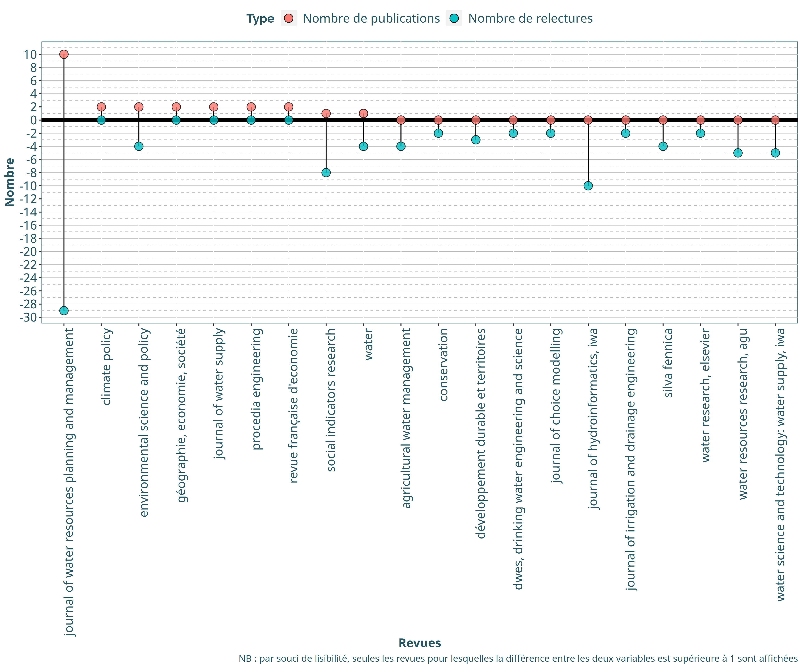

HCERES Annexe 4 : Focus sur l’axe 3
================

  - [Exploitation des données](#exploitation-des-données)
      - [Production de connaissances](#production-de-connaissances)
          - [Quantification de la
            production](#quantification-de-la-production)
          - [Revues scientifiques](#revues-scientifiques)
      - [Partenariats](#partenariats)

# Exploitation des données

### Production de connaissances

#### Quantification de la production

Nous étudions dans un premier temps le nombre d’articles, d’actes de
colloques et de chapitres d’ouvrages publiés par des agents de l’unité.

<div class="kable-table">

| Type               | 2017 | 2018 | 2019 | 2020 |
| :----------------- | ---: | ---: | ---: | ---: |
| Articles           |   20 |   13 |   11 |    5 |
| Autres articles    |    2 |    3 |    1 |   NA |
| Actes colloques    |    5 |    9 |    4 |   NA |
| Chapitres ouvrages |    1 |    1 |    2 |   NA |

</div>

Il y a **40** articles scientifiques et **3** chapitres d’ouvrages en
langue anglaise.

#### Revues scientifiques

En ce qui concerne les revues, voici un nuage des revues auxquelles sont
soumis les articles scientifiques :


Nous pouvons ensuite observer si notre unité est bien identifiée dans
les revues dans lesquelles elle publie :

Nous pouvons représenter ces deux variables (nombre de publications /
nombre de relectures) sur un même graphique. Dans un soucis de
lisibilité, nous ne conservons que les revues pour lesquelles la
différence entre les deux variables est supérieure à 1.


Et voici une version alternative avec l’une des variables passée en
négatif afin de mieux distinguer les deux variables :



### Partenariats

> **BESOIN LISTE AUTEURS AXE 3 POUR CONTINUER**

<!-- #### Interdisciplinarité proche (interne) -->

<!-- A partir du tableau rempli par l'équipe du GT4, nous pouvons créer une liste de noms d'auteurs (prenant en compte toutes les syntaxes possibles d'un même nom) appartenant à ETBX. -->

<!-- ```{r} -->

<!-- table_auteurs <- readxl::read_excel("data/Table_auteurs_ETBX_2020-08-17_BH.xlsx") %>% clean_names() -->

<!-- liste_auteurs_etbx <- table_auteurs %>% -->

<!--   filter(etbx_oui_non %in% c("oui", "temporaire", "oui / BSA")) %>% -->

<!--   pull(auteur) -->

<!-- liste_auteurs_etbx -->

<!-- ``` -->

<!-- Chacun des agents ETBX a aussi été affecté à une discipline, en accord avec les informations présentées sur le site web de l'unité [https://www6.bordeaux-aquitaine.inrae.fr/etbx/Les-equipes](https://www6.bordeaux-aquitaine.inrae.fr/etbx/Les-equipes). -->

<!-- (Fichier : `table_auteurs_ETBX_2020-08-17_BH.xlsx`). -->

<!-- Nous pouvons donc quantifier le nombre d'auteurs ETBX pour chaque production scientifique (comprenant les articles scientifiques et les chapitres d'ouvrages) : -->

<!-- ```{r} -->

<!-- calcul_nb_copubli <- function(x) { -->

<!--   liste_auteurs_etbx[str_detect(x, liste_auteurs_etbx)] %>% -->

<!--     gsub("^\\.|\\.$", "", .) %>% -->

<!--     unique() %>% -->

<!--     length() -->

<!-- } -->

<!-- tab_copubli <- bind_rows( -->

<!--   ANX4$i_1_articles_sctfq %>% -->

<!--     clean_names() %>% -->

<!--    filter(axe_3 == "x") %>%  -->

<!--     select(reference_complete) %>% -->

<!--     rowwise() %>% -->

<!--     mutate(nb_copubli = calcul_nb_copubli(reference_complete)) %>% -->

<!--     ungroup() %>% -->

<!--     arrange(desc(nb_copubli)), -->

<!--   ANX4$i_2_chap_ouvrages %>% -->

<!--     clean_names() %>% -->

<!--    filter(axe_3 == "x") %>% -->

<!--     select(reference_complete) %>% -->

<!--     rowwise() %>% -->

<!--     mutate(nb_copubli = calcul_nb_copubli(reference_complete)) %>% -->

<!--     ungroup() %>% -->

<!--     arrange(desc(nb_copubli)) -->

<!-- ) %>% -->

<!--   filter(nb_copubli > 1) -->

<!-- ggplot(tab_copubli, aes(x = nb_copubli)) + -->

<!--   geom_histogram(fill = "#00a3a6", color = "black", binwidth = 1) + -->

<!--   theme_inrae() + -->

<!--   scale_y_continuous(breaks = seq(0, 40, 2)) + -->

<!--   labs(x = "Nombre de co-auteurs ETBX sur une production scientifique", y = "Fréquence") -->

<!-- ``` -->

<!-- Avec l'information du nombre de co-auteurs, nous pouvons corriger le nuage de revues précédent en le pondérant par le nombre moyen de co-auteurs ETBX par publication pour chaque revue. -->

<!-- ```{r} -->

<!-- word_count <- ANX4$i_1_articles_sctfq %>% -->

<!--   clean_names() %>% -->

<!--   filter(axe_3 == "x") %>%  -->

<!--   select(reference_complete, journal) %>% -->

<!--   rowwise() %>% -->

<!--   mutate(nb_copubli = calcul_nb_copubli(reference_complete)) %>% -->

<!--   ungroup() %>% -->

<!--   mutate(journal = clean_revues(journal)) %>% -->

<!--   group_by(journal) %>% -->

<!--   summarise(nb_moyen = mean(nb_copubli)) %>% -->

<!--   ungroup() %>% -->

<!--   arrange(desc(nb_moyen)) -->

<!-- # wordcloud2(word_count, size = 0.35) -->

<!-- ``` -->

<!--  -->

<!-- Grâce à la classification JCR (https://jcr.clarivate.com) nous pouvons classer les revues selon des grandes catégories disciplinaires. Ci dessous un tableau des 48 revues pour lesquelles une correspondance de catégorie a pu être récupérée. -->

<!-- ```{r categ_jcr} -->

<!-- liste_revues_jcr <- list() -->

<!-- for (i in list.files("data/revues")) { -->

<!--   nom <- str_remove_all(i, ".csv") -->

<!--   liste_revues_jcr[[nom]] <- read_csv(file.path("data/revues/", i), skip = 1) %>% -->

<!--     tibble() %>% -->

<!--     janitor::clean_names() %>% -->

<!--     select(full_journal_title, total_cites, journal_impact_factor) %>% -->

<!--     mutate( -->

<!--       total_cites = as.numeric(total_cites), -->

<!--       journal_impact_factor = as.numeric(journal_impact_factor) -->

<!--     ) %>% -->

<!--     mutate(CATEGORY = nom) -->

<!-- } -->

<!-- table_jcr <- bind_rows(liste_revues_jcr) %>% -->

<!--   mutate(full_journal_title = str_to_lower(full_journal_title)) %>% -->

<!--   unique() -->

<!-- tab_relecture_articles$revue_ouvrage[tab_relecture_articles$revue_ouvrage %in% table_jcr$full_journal_title] -->

<!-- ``` -->

<!-- Voici donc le résumé du nombre de publications par catégorie JCR : -->

<!-- ```{r out.width="100%", fig.width = 13, fig.height = 9} -->

<!-- tab_relecture_articles %>% -->

<!--   inner_join(table_jcr, by = c("revue_ouvrage" = "full_journal_title")) %>% -->

<!--   group_by(CATEGORY) %>% -->

<!--   count() %>% -->

<!--   ungroup() %>% -->

<!--   ggplot(aes(x = reorder(CATEGORY, n), y = n)) + -->

<!--   geom_col(fill = "#00a3a6", color = "black") + -->

<!--   geom_label(aes(label = n)) + -->

<!--   coord_flip() + -->

<!--   theme_inrae() + -->

<!--   labs(y = "Nombre de publications", x = "Catégorie JCR") -->

<!-- ``` -->

<!-- Nous pouvons maintenant nous intéresser aux disciplines. Nous pouvons dénombrer le nombre de disciplines mobilisées pour chaque production scientifique (comprenant les articles scientifiques et les chapitres d'ouvrages) : -->

<!-- ```{r} -->

<!-- table_disciplines_auteurs <- table_auteurs %>% -->

<!--   filter(etbx_oui_non %in% c("oui", "temporaire", "oui / BSA")) %>% -->

<!--   select(auteur, discipline) %>% -->

<!--   drop_na() -->

<!-- calcul_discipline <- function(x) { -->

<!--   df <- data.frame(auteur = liste_auteurs_etbx[str_detect(x, liste_auteurs_etbx)] %>% gsub("^\\.|\\.$", "", .) %>% unique()) -->

<!--   df %>% -->

<!--     inner_join(table_disciplines_auteurs, by = "auteur") %>% -->

<!--     pull(discipline) %>% -->

<!--     unique() %>% -->

<!--     paste(collapse = " / ") -->

<!-- } -->

<!-- tab_disciplines <- bind_rows( -->

<!--   ANX4$i_1_articles_sctfq %>% -->

<!--     clean_names() %>% -->

<!--     select(reference_complete) %>% -->

<!--     rowwise() %>% -->

<!--     mutate(disciplines = calcul_discipline(reference_complete)) %>% -->

<!--     mutate(nb_disciplines = str_split(disciplines, " / ")[[1]] %>% length()) %>% -->

<!--     ungroup(), -->

<!--   ANX4$i_2_chap_ouvrages %>% -->

<!--     clean_names() %>% -->

<!--     select(reference_complete) %>% -->

<!--     rowwise() %>% -->

<!--     mutate(disciplines = calcul_discipline(reference_complete)) %>% -->

<!--     mutate(nb_disciplines = str_split(disciplines, " / ")[[1]] %>% length()) %>% -->

<!--     ungroup() -->

<!-- ) %>% filter(nb_disciplines > 1) -->

<!-- ggplot(tab_disciplines, aes(x = nb_disciplines)) + -->

<!--   geom_histogram(fill = "#00a3a6", color = "black", binwidth = 1) + -->

<!--   theme_inrae() + -->

<!--   scale_y_continuous(breaks = seq(0, 40, 2)) + -->

<!--   labs(x = "Nombre de disciplines impliquées sur une production scientifique", y = "Fréquence") -->

<!-- ``` -->

<!-- ```{r} -->

<!-- mono_dis <- bind_rows( -->

<!--   ANX4$i_1_articles_sctfq %>% -->

<!--     clean_names() %>% -->

<!--     select(reference_complete) %>% -->

<!--     rowwise() %>% -->

<!--     mutate(nb_copubli = calcul_nb_copubli(reference_complete)) %>% -->

<!--     mutate(disciplines = calcul_discipline(reference_complete)) %>% -->

<!--     mutate(nb_disciplines = str_split(disciplines, " / ")[[1]] %>% length()), -->

<!--   ANX4$i_2_chap_ouvrages %>% -->

<!--     clean_names() %>% -->

<!--     select(reference_complete) %>% -->

<!--     rowwise() %>% -->

<!--     mutate(nb_copubli = calcul_nb_copubli(reference_complete)) %>% -->

<!--     mutate(disciplines = calcul_discipline(reference_complete)) %>% -->

<!--     mutate(nb_disciplines = str_split(disciplines, " / ")[[1]] %>% length()) -->

<!-- ) %>% -->

<!--   filter(nb_copubli > 1 & nb_disciplines == 1) -->

<!-- ``` -->

<!-- ```{r} -->

<!-- solo <- ANX4$i_1_articles_sctfq %>% -->

<!--   clean_names() %>% -->

<!--   select(reference_complete) %>% -->

<!--   rowwise() %>% -->

<!--   mutate(nb_copubli = calcul_nb_copubli(reference_complete)) %>% -->

<!--   filter(nb_copubli == 1) -->

<!-- ``` -->
