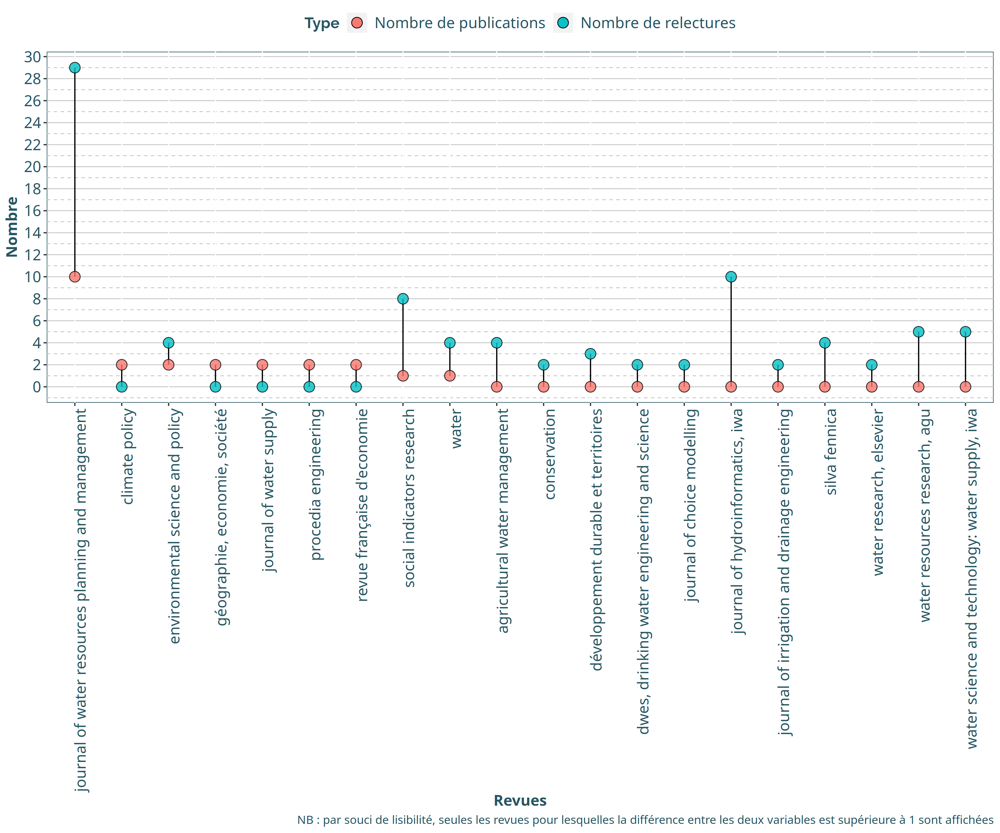
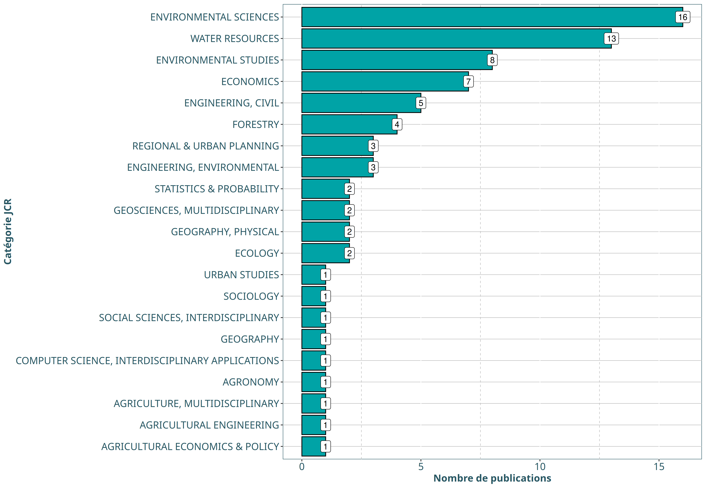

HCERES Annexe 4 : Focus sur l’axe 3
================

  - [Exploitation des données](#exploitation-des-données)
      - [Production de connaissances](#production-de-connaissances)
          - [Quantification de la
            production](#quantification-de-la-production)
          - [Revues scientifiques](#revues-scientifiques)
      - [Partenariats](#partenariats)
          - [Interdisciplinarité proche
            (interne)](#interdisciplinarité-proche-interne)

# Exploitation des données

### Production de connaissances

#### Quantification de la production

Nous étudions dans un premier temps le nombre d’articles, d’actes de
colloques et de chapitres d’ouvrages publiés par des agents de l’unité.

| Type               | 2017 | 2018 | 2019 | 2020 |
| :----------------- | ---: | ---: | ---: | ---: |
| Articles           |   20 |   13 |   11 |    7 |
| Autres articles    |    2 |    3 |    1 |   NA |
| Actes colloques    |    5 |    9 |    4 |   NA |
| Chapitres ouvrages |    1 |    1 |    2 |   NA |

Production en langue anglaise : **40** articles scientifiques et **3**
chapitres d’ouvrages.

#### Revues scientifiques

En ce qui concerne les revues, voici un nuage des revues auxquelles sont
soumis les articles scientifiques :

Nous pouvons ensuite observer si notre unité est bien identifiée dans
les revues dans lesquelles elle publie :

Nous pouvons représenter ces deux variables (nombre de publications /
nombre de relectures) sur un même graphique. Dans un soucis de
lisibilité, nous ne conservons que les revues pour lesquelles la
différence entre les deux variables est supérieure à 1.

### Partenariats

#### Interdisciplinarité proche (interne)

A partir du tableau rempli par l’équipe du GT4, nous pouvons créer une
liste de noms d’auteurs (prenant en compte toutes les syntaxes possibles
d’un même nom) appartenant à ETBX. **Nous effectuons une sous-sélection
des agents en ne conservant que ceux rattachés à l’axe 3.**

    ##  [1] "Boschet C"           "Boschet, C"          "Caillaud, K."       
    ##  [4] "Carayon, D"          "Dachary Bernard, J"  "Dachary Bernard, J."
    ##  [7] "Dachary-Bernard, J"  "Dachary-Bernard, J." "Gilbert, D"         
    ## [10] "Husson, A"           "Husson, A."          "Kuentz Simonet, V"  
    ## [13] "Kuentz-Simonet V"    "Kuentz-Simonet, V"   "Leccia Phelpin, O"  
    ## [16] "Leccia-Phelpin, O"   "Leccia, O"           "Leccia, O."         
    ## [19] "Le Gat, Y"           "Le Gat, Y."          "Lescot J-M."        
    ## [22] "Lescot J.-M"         "Lescot, J.M"         "Lescot, J.M."       
    ## [25] "Lyser S."            "Lyser, S"            "Lyser, S."          
    ## [28] "Piller O"            "Piller, O"           "Piller, O."         
    ## [31] "Rambonilaza T"       "Rambonilaza T."      "Rambonilaza, M"     
    ## [34] "Rambonilaza, T"      "Rambonilaza, T."     "Renaud, E"          
    ## [37] "Renaud, E."          "Rulleau, B"          "Rulleau, B."        
    ## [40] "Salles D"            "Salles, D"           "Salles, D."         
    ## [43] "Stricker, A. E"      "Stricker, A. E."     "Stricker, A.E"      
    ## [46] "Stricker, A.E."      "Terreaux, J.P"       "Terreaux, J.P."

Chacun des agents ETBX a aussi été affecté à une discipline, en accord
avec les informations présentées sur le site web de l’unité
<https://www6.bordeaux-aquitaine.inrae.fr/etbx/Les-equipes>.

(Fichier : `table_auteurs_ETBX_2020-08-17_BH.xlsx`).

Nous pouvons donc quantifier le nombre d’auteurs ETBX pour chaque
production scientifique (comprenant les articles scientifiques et les
chapitres d’ouvrages) :

| Nombre de co-auteurs ETBX de l’axe 3 sur une production scientifique | Fréquence |
| -------------------------------------------------------------------: | --------: |
|                                                                    2 |        10 |
|                                                                    3 |         1 |
|                                                                    4 |         1 |

Avec l’information du nombre de co-auteurs, nous pouvons corriger le
nuage de revues précédent en le pondérant par le nombre moyen de
co-auteurs ETBX par publication pour chaque revue.

Grâce à la classification JCR (<https://jcr.clarivate.com>) nous pouvons
classer les revues selon des grandes catégories disciplinaires. Ci
dessous un tableau des 48 revues pour lesquelles une correspondance de
catégorie a pu être récupérée.

    ##  [1] "agricultural systems"                                 
    ##  [2] "agricultural water management"                        
    ##  [3] "annals of forest science"                             
    ##  [4] "climate policy"                                       
    ##  [5] "climatic change"                                      
    ##  [6] "comptes rendus geoscience"                            
    ##  [7] "computational statistics"                             
    ##  [8] "ecological economics"                                 
    ##  [9] "ecological indicators"                                
    ## [10] "energy economics"                                     
    ## [11] "energy policy"                                        
    ## [12] "environmental pollution"                              
    ## [13] "environmental science and pollution research"         
    ## [14] "european review of agricultural economics"            
    ## [15] "forest policy and economics"                          
    ## [16] "journal of choice modelling"                          
    ## [17] "journal of coastal research"                          
    ## [18] "journal of environmental management"                  
    ## [19] "journal of environmental planning and management"     
    ## [20] "journal of environmental policy & planning"           
    ## [21] "journal of hydraulic engineering"                     
    ## [22] "journal of hydroinformatics"                          
    ## [23] "journal of irrigation and drainage engineering"       
    ## [24] "journal of water resources planning and management"   
    ## [25] "land use policy"                                      
    ## [26] "landscape and urban planning"                         
    ## [27] "regional environmental change"                        
    ## [28] "river research and applications"                      
    ## [29] "silva fennica"                                        
    ## [30] "small-scale forestry"                                 
    ## [31] "social indicators research"                           
    ## [32] "stochastic environmental research and risk assessment"
    ## [33] "urban water journal"                                  
    ## [34] "water"                                                
    ## [35] "water and environment journal"                        
    ## [36] "water research"                                       
    ## [37] "water resources and economics"                        
    ## [38] "water science and technology"

Voici donc le résumé du nombre de publications par catégorie JCR :

Nous pouvons maintenant nous intéresser aux disciplines. Nous pouvons
dénombrer le nombre de disciplines mobilisées pour chaque production
scientifique (comprenant les articles scientifiques et les chapitres
d’ouvrages) :

| Nombre de disciplines impliquées sur une production scientifique | Fréquence |
| ---------------------------------------------------------------: | --------: |
|                                                                2 |        10 |
|                                                                3 |         1 |

Autre indicateurs:

  - Il y a **2** publications avec \> 2 agents ETBX (de l’axe 3) mais où
    ces agents sont de la **même discipline**.

  - Il y a **37** publications où **un seul** agent ETBX de l’axe 3 est
    impliqué.
