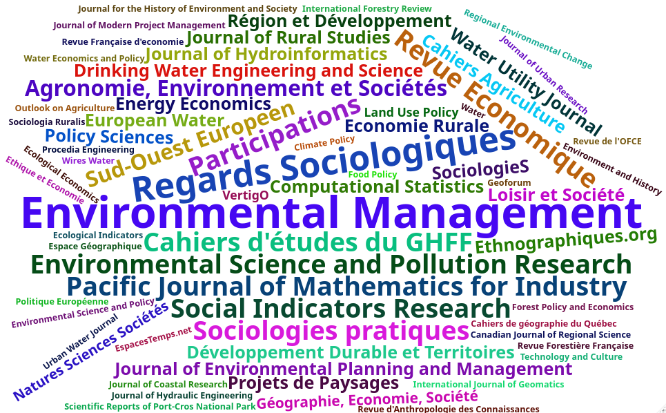

```{r setup, include=FALSE}
knitr::opts_chunk$set(echo = FALSE, warning = FALSE, message = FALSE, out.width = "100%", dpi = 320)
```


```{r packages}
library(dplyr)
library(tidyr)
library(lubridate)
library(janitor)
library(ggplot2)
library(readxl)
library(purrr)
library(bib2df)
library(wordcloud2)
library(stringr)
library(readr)
library(tidytext)

source("R/theme_inrae.R")
```


```{r}
# Fichier en date du 03/08/2020
file <- "data/Annexe4_ETBX_complet_2020_08_03.xlsx"


# On réalise une boucle pour importer tous les onglets dans un seul objet, sous forme de liste

sheet_names <- readxl::excel_sheets(file)
ANX4 <- list()

for (i in sheet_names[-1:-3]) {
  ANX4[[i]] <- readxl::read_excel(file, sheet = i, skip = 1) %>%
    select(-1) # Retrait colonne n°
}

# On rend exploitables les noms d'onglets
names(ANX4) <- janitor::make_clean_names(names(ANX4))
```


```{r}
replace_cases <- function(x) {
  value <- ifelse(is.na(x), yes = 0, no = 1)

  return(value)
}
```

# Exploitation des données

## Premiers indicateurs

### Projets

> **NB : Il y a un projet international (le seul) à la fin inconnue... Donc par défaut j'ai décidé la fin en 2024 pour ne pas changer la tête du graphique tout en conservant l'info qu'il y a un projet international.**

```{r out.width = "100%", fig.width = 13, fig.height = 10}

## Extraction des projets nationaux
projets_nationaux <- ANX4$i_9_contrats_nationaux %>%
  clean_names() %>%
  select(-x11) %>%
  drop_na(contrat) %>%
  drop_na(date_debut) %>%
  mutate(type = "National")

## Projets européens
projets_europ <- ANX4$i_9_contrats_europ_autres %>%
  drop_na(`Date début`) %>%
  clean_names() %>%
  mutate_at(vars(date_debut:date_fin), as.Date) %>%
  mutate(type = "Européen")

## Projets internationaux
projets_inter <- ANX4$i_9_contrats_internationaux %>%
  clean_names() %>%
  mutate_at(vars(date_debut:date_fin), as.Date) %>%
  mutate(type = "International")

## Projets R&D
projets_rd <- ANX4$i_9_contrats_prive_r_d_indus %>%
  clean_names() %>%
  mutate_at(vars(date_debut:date_fin), as.Date) %>%
  mutate(type = "R&D")

## Projets PIA
projets_pia <- ANX4$i_9_contrats_pia %>%
  clean_names() %>%
  drop_na(contrat, date_debut) %>%
  mutate_at(vars(date_debut:date_fin), as.Date) %>%
  mutate(type = "PIA")

## Projets de collectivités territoriales
projets_coll_terri <- ANX4$i_9_contrats_coll_territ %>%
  clean_names() %>%
  drop_na(contrat, date_debut, date_fin) %>%
  mutate_at(vars(date_debut), as.Date, origin = "1899-12-31") %>%
  mutate(type = "National")

## On assemble le tout
PRJ <- bind_rows(projets_nationaux, projets_europ) %>%
  bind_rows(projets_inter) %>%
  bind_rows(projets_rd) %>%
  bind_rows(projets_pia) %>%
  bind_rows(projets_coll_terri) %>%
  mutate_at(vars(porteur:axe_3), replace_cases) %>%
  unique() %>%
  mutate(date_fin = replace_na(date_fin, "2024-01-01")) %>%
  mutate(porteur = recode(porteur, "0" = "Non porteur", "1" = "Porteur")) %>%
  mutate(porteur = factor(porteur, levels = c("Porteur", "Non porteur"))) %>%
  group_by(contrat) %>%
  summarise(
    date_debut = min(date_debut),
    date_fin = max(date_fin),
    porteur = unique(porteur),
    type = unique(type)
  ) %>%
  ungroup() %>%
  arrange(desc(date_debut)) %>%
  mutate(contrat = factor(contrat, levels = unique(contrat)))
```

Nous pouvons dans un premier temps représenter graphiquement la chronologie des contrats :

```{r out.width = "100%", fig.width = 15, fig.height = 17}
ggplot(PRJ, aes(x = date_fin, y = contrat)) +
  geom_segment(aes(x = date_debut, xend = date_fin, y = contrat, yend = contrat, color = type, linetype = porteur), size = 1.5) +
  scale_y_discrete(limits = rev(levels(PRJ$contrat))) +
  geom_point(fill = "black", color = "black", size = 3) +
  geom_point(aes(x = date_debut, y = contrat), color = "black", fill = "black", size = 3) +
  theme_inrae() +
  theme(axis.text.y = element_text(size = 10)) +
  labs(x = "Temps", y = "Contrats", color = "Type de contrat", linetype = "ETBX porteur ?")  +
  theme(panel.grid.minor.x = element_blank())
```

Et dénombrer le nombre de contrats pour lesquels ETBX est porteur ou non, ainsi que les types de contrats :

```{r}
PRJ %>% count(porteur)

PRJ %>% count(type)
```

Nous pouvons aussi compter combien de contrats **commencent** chaque année (NB: et qui sont encore en cours sur la période 2017-2020, les contrats qui débutent avant 2017 mais qui ont pris fin avant 2017 ne sont pas comptabilisés).

```{r}
PRJ %>%
  mutate(
    annee_debut = lubridate::year(date_debut),
    annee_fin = lubridate::year(date_fin)
  ) %>%
  group_by(annee_debut) %>%
  count(type) %>%
  spread(key = annee_debut, value = n) %>%
  ungroup() %>%
  mutate_at(vars(`2013`:`2019`), replace_na, 0)
```

Et combien **finissent** chaque année, à partir de 2017 :

```{r}
PRJ %>%
  mutate(
    annee_debut = lubridate::year(date_debut),
    annee_fin = lubridate::year(date_fin)
  ) %>%
  group_by(annee_fin) %>%
  count(type) %>%
  spread(key = annee_fin, value = n) %>%
  ungroup() %>%
  mutate_at(vars(`2017`:`2025`), replace_na, 0)
```

Nous pouvons enfin quantifier, chaque année, combien de projets sont **en cours** (NB: Pour les années antérieures à 2017, seuls les contrats prenant fin à partir de 2017 sont comptabilisés).

```{r}

par_an <- PRJ %>%
  mutate(
    annee_debut = lubridate::year(date_debut),
    annee_fin = lubridate::year(date_fin)
  )

l <- list()

for (i in 2014:2020) {
  l[[as.character(i)]] <- par_an %>%
    filter(annee_debut <= i & annee_fin >= i) %>%
    mutate(an = i)
}


count_type <- function(df) {
  df %>%
    group_by(type, an) %>%
    count() %>%
    arrange(desc(n))
}


map(l, count_type) %>%
  bind_rows() %>%
  spread(key = an, value = n) %>%
  ungroup() %>%
  mutate_at(vars(`2014`:`2020`), replace_na, 0)
```

### Production de connaissances


#### Quantification de la production

Nous étudions dans un premier temps le nombre d'articles, d'actes de colloques et de chapitres d'ouvrages publiés par des agents de l'unité.

```{r}
acl1 <- ANX4$i_1_articles_sctfq %>%
  clean_names() %>%
  mutate(year = stringr::str_extract(reference_complete, "\\d{4}")) %>%
  drop_na(year) %>%
  group_by(year) %>%
  summarise(n = n_distinct(reference_complete)) %>%
  spread(key = year, value = n) %>%
  mutate(Type = "Articles")


acl2 <- ANX4$i_1_autres_articles %>%
  clean_names() %>%
  mutate(year = stringr::str_extract(reference_complete, "\\d{4}")) %>%
  filter(year != 2016) %>%
  drop_na(year) %>%
  group_by(year) %>%
  summarise(n = n_distinct(reference_complete)) %>%
  spread(key = year, value = n) %>%
  mutate(Type = "Autres articles")


acl3 <- ANX4$i_3_articles_actes_colloq %>%
  clean_names() %>%
  mutate(year = stringr::str_extract(reference_complete, "\\d{4}")) %>%
  drop_na(year) %>%
  group_by(year) %>%
  summarise(n = n_distinct(reference_complete)) %>%
  spread(key = year, value = n) %>%
  mutate(Type = "Actes colloques")


acl4 <- ANX4$i_2_chap_ouvrages %>%
  clean_names() %>%
  mutate(year = stringr::str_extract(reference_complete, "\\d{4}")) %>%
  drop_na(year) %>%
  group_by(year) %>%
  summarise(n = n_distinct(reference_complete)) %>%
  spread(key = year, value = n) %>%
  mutate(Type = "Chapitres ouvrages")

bind_rows(acl1, acl2, acl3, acl4) %>%
  select(Type, `2017`:`2020`)
```

```{r}
nb_art_ang <- ANX4$i_1_articles_sctfq %>%
  clean_names() %>%
  filter(articles_scientifiques_en_anglais_ou_dans_une_autre_langue_etrangere_shs_uniquement == "x") %>%
  nrow()


# ANX4$i_1_autres_articles %>%
#   clean_names() %>%
#   filter(autres_articles_articles_publies_dans_des_revues_professionnelles_ou_techniques_etc_en_anglais_ou_dans_une_autre_langue_etrangere_shs_uniquement == "x") %>%
#   nrow()

nb_ouv_ang <- ANX4$i_2_chap_ouvrages %>%
  clean_names() %>%
  filter(chapitres_d_ouvrage_en_anglais_ou_dans_une_autre_langue_etrangere == "x") %>%
  nrow()
```

Production en langue anglaise : **`r nb_art_ang`** articles scientifiques et **`r nb_ouv_ang`** chapitres d'ouvrages.

#### Revues scientifiques

En ce qui concerne les revues, voici un nuage des revues auxquelles sont soumis les articles scientifiques :

```{r, width = 10, height = 10, fig.align = "center", out.width = "100%"}

clean_revues <- function(x) {
  r <- case_when(
    x == "water research, elsevier" ~ "water research",
    x == "water resources research, agu" ~ "water resources research",
    x == "water, mdpi journal" ~ "water",
    x == "water science and technology: water supply, iwa" ~ "water science and technology: water supply",
    x == "vertigo - la revue électronique en sciences de l'environnement 1" ~ "vertigo",
    x == "revue internationale des etudes du développement" ~ "revue internationale des etudes du developpement",
    x == "journal of hydroinformatics, iwa" ~ "journal of hydroinformatics",
    x == TRUE ~ x
  )

  if (is.na(r)) {
    return(x)
  }

  return(r)
}


word_count <- ANX4$i_1_articles_sctfq %>%
  clean_names() %>%
  mutate(journal = clean_revues(journal)) %>%
  group_by(journal) %>%
  count() %>%
  arrange(desc(n)) %>%
  ungroup() %>%
  rowwise() %>%
  mutate(n = ifelse(journal == "Journal of Water Resources Planning and Management", yes = 7, no = n)) %>%
  mutate(journal = ifelse(journal == "Journal of Water Resources Planning and Management", yes = "Water Res. Planning and Management", no = journal)) %>%
  ungroup() %>%
  mutate(journal = str_to_lower(journal)) %>%
  mutate(journal = str_trim(journal))

# wordcloud2(word_count, size = 0.35)
```


Nous pouvons ensuite observer si notre unité est bien identifiée dans les revues dans lesquelles elle publie : 

```{r}
articles <- ANX4$i_1_articles_sctfq %>%
  clean_names() %>%
  mutate(journal = clean_revues(journal)) %>%
  group_by(journal) %>%
  count() %>%
  arrange(desc(n)) %>%
  mutate(journal = str_to_lower(journal)) %>%
  mutate(journal = str_trim(journal))


tab_relecture_articles <- ANX4$i_8_evaluation_articles %>%
  clean_names() %>%
  select(revue_ouvrage, nombre_de_relectures) %>%
  mutate(revue_ouvrage = str_to_lower(revue_ouvrage)) %>%
  mutate(revue_ouvrage = str_trim(revue_ouvrage)) %>%
  full_join(articles, by = c("revue_ouvrage" = "journal")) %>%
  arrange(revue_ouvrage) %>%
  unique() %>%
  mutate(revue_ouvrage = clean_revues(revue_ouvrage)) %>%
  group_by(revue_ouvrage) %>%
  summarise(n_relecture = sum(nombre_de_relectures, na.rm = TRUE), n_publi = sum(n, na.rm = TRUE)) %>%
  ungroup() %>%
  unique()
```

Nous pouvons représenter ces deux variables (nombre de publications / nombre de relectures) sur un même graphique. Dans un soucis de lisibilité, nous ne conservons que les revues pour lesquelles la différence entre les deux variables est supérieure à 1.

```{r out.width = "100%", fig.width = 12, fig.height = 10}
tab_relecture_articles %>%
  mutate(diff = abs(n_publi - n_relecture)) %>%
  filter(diff > 1) %>%
  ggplot(aes(x = reorder(revue_ouvrage, -n_publi))) +
  geom_segment(aes(
    x = reorder(revue_ouvrage, -n_publi), xend = reorder(revue_ouvrage, -n_publi),
    y = n_publi, yend = n_relecture
  )) +
  geom_point(aes(y = n_publi, fill = "Nombre de publications"), color = "black", shape = 21, size = 4, alpha = 0.8) +
  geom_point(aes(y = n_relecture, fill = "Nombre de relectures"), color = "black", shape = 21, size = 4, alpha = 0.8) +
  theme_inrae() +
  theme(axis.text.x = element_text(angle = 90, hjust = 1)) +
  labs(x = "Revues", y = "Nombre", fill = "Type") +
  scale_y_continuous(breaks = seq(0, 30, 2)) +
  labs(caption = "NB : par souci de lisibilité, seules les revues pour lesquelles la différence entre les deux variables est supérieure à 1 sont affichées")
```

#### Nombre de citations 

L'information du nombre de citations n'est évidemment pas indiqué dans le document excel. 

Il est cependant possible de récupérer cette information via le portail HAL-INRAE. Ceci implique de travailler, forcément, avec un nombre réduit de publications par rapport au document excel.

Un export de la base HAL a donc été réalisé avec ces deux critères :

- Année 2017-2020

- Unité = ETBX

```{r}
HAL <- jsonlite::fromJSON("data/ETBX_2017_2020.json")$response$docs %>% tibble()
```


A partir de cet export HAL-INRAE, nous récupérons `r n_distinct(HAL$doiId_s)` DOI, que nous utilisons pour extraire sur scopus le nombre de citations pour chacun de ces documents.

```{r}
base_doi <- HAL %>%
  drop_na(doiId_s) %>%
  distinct(doiId_s)

## On crée la requête
# base_doi %>%
#   mutate(request = paste0("DOI(",doiId_s,")")) %>%
#   pull(request) %>%
#   paste0(collapse = " OR ")
```

Cette requête a permis de récupérer des données de citations pour **52** articles. Voici donc, à ce jour, le nombre de citations pour ces articles en fonction de leur année de publication : 

```{r}
read_csv("data/scopus.csv") %>%
  clean_names() %>%
  group_by(year) %>%
  summarise(n_citations = sum(cited_by, na.rm = TRUE)) %>%
  select(`Année` = year, n_citations)
```

### Partenariats

#### Interdisciplinarité proche (interne)

A partir du tableau rempli par l'équipe du GT4, nous pouvons créer une liste de noms d'auteurs (prenant en compte toutes les syntaxes possibles d'un même nom) appartenant à ETBX.

```{r}
table_auteurs <- readxl::read_excel("data/Table_auteurs_ETBX_2020-08-17_BH.xlsx") %>% clean_names()

liste_auteurs_etbx <- table_auteurs %>%
  filter(etbx_oui_non %in% c("oui", "temporaire", "oui / BSA")) %>%
  pull(auteur)
```

Chacun des agents ETBX a aussi été affecté à une discipline, en accord avec les informations présentées sur le site web de l'unité [https://www6.bordeaux-aquitaine.inrae.fr/etbx/Les-equipes](https://www6.bordeaux-aquitaine.inrae.fr/etbx/Les-equipes).

(Fichier : `table_auteurs_ETBX_2020-08-17_BH.xlsx`).

Nous pouvons donc quantifier le nombre d'auteurs ETBX pour chaque production scientifique (comprenant les articles scientifiques et les chapitres d'ouvrages) :

```{r}

calcul_nb_copubli <- function(x) {
  liste_auteurs_etbx[str_detect(x, liste_auteurs_etbx)] %>%
    gsub("^\\.|\\.$", "", .) %>%
    unique() %>%
    length()
}

tab_copubli <- bind_rows(
  ANX4$i_1_articles_sctfq %>%
    clean_names() %>%
    select(reference_complete) %>%
    rowwise() %>%
    mutate(nb_copubli = calcul_nb_copubli(reference_complete)) %>%
    ungroup() %>%
    arrange(desc(nb_copubli)),


  ANX4$i_2_chap_ouvrages %>%
    clean_names() %>%
    select(reference_complete) %>%
    rowwise() %>%
    mutate(nb_copubli = calcul_nb_copubli(reference_complete)) %>%
    ungroup() %>%
    arrange(desc(nb_copubli))
) %>%
  filter(nb_copubli > 1)
# 
# ggplot(tab_copubli, aes(x = nb_copubli)) +
#   geom_histogram(fill = "#00a3a6", color = "black", binwidth = 1) +
#   theme_inrae() +
#   scale_y_continuous(breaks = seq(0, 40, 2)) +
#   labs(x = "Nombre de co-auteurs ETBX sur une production scientifique", y = "Fréquence")


tab_copubli %>% count(nb_copubli) %>% rename("Nombre de co-auteurs ETBX sur une production scientifique"="nb_copubli","Fréquence"="n")

```

Avec l'information du nombre de co-auteurs, nous pouvons corriger le nuage de revues précédent en le pondérant par le nombre moyen de co-auteurs ETBX par publication pour chaque revue.

```{r}
word_count <- ANX4$i_1_articles_sctfq %>%
  clean_names() %>%
  select(reference_complete, journal) %>%
  rowwise() %>%
  mutate(nb_copubli = calcul_nb_copubli(reference_complete)) %>%
  ungroup() %>%
  mutate(journal = clean_revues(journal)) %>%
  group_by(journal) %>%
  summarise(nb_moyen = mean(nb_copubli)) %>%
  ungroup() %>%
  arrange(desc(nb_moyen))

# wordcloud2(word_count, size = 0.35)
```



Grâce à la classification JCR (https://jcr.clarivate.com) nous pouvons classer les revues selon des grandes catégories disciplinaires. Ci dessous un tableau des 48 revues pour lesquelles une correspondance de catégorie a pu être récupérée.

```{r categ_jcr}
liste_revues_jcr <- list()


for (i in list.files("data/revues")) {
  nom <- str_remove_all(i, ".csv")

  liste_revues_jcr[[nom]] <- read_csv(file.path("data/revues/", i), skip = 1) %>%
    tibble() %>%
    janitor::clean_names() %>%
    select(full_journal_title, total_cites, journal_impact_factor) %>%
    mutate(
      total_cites = as.numeric(total_cites),
      journal_impact_factor = as.numeric(journal_impact_factor)
    ) %>%
    mutate(CATEGORY = nom)
}

table_jcr <- bind_rows(liste_revues_jcr) %>%
  mutate(full_journal_title = str_to_lower(full_journal_title)) %>%
  unique()


# tab_relecture_articles$revue_ouvrage[tab_relecture_articles$revue_ouvrage %in% table_jcr$full_journal_title]
```

Voici donc le résumé du nombre de publications par catégorie JCR :

```{r out.width="100%", fig.width = 13, fig.height = 9}
tab_relecture_articles %>%
  inner_join(table_jcr, by = c("revue_ouvrage" = "full_journal_title")) %>%
  group_by(CATEGORY) %>%
  count() %>%
  ungroup() %>%
  ggplot(aes(x = reorder(CATEGORY, n), y = n)) +
  geom_col(fill = "#00a3a6", color = "black") +
  geom_label(aes(label = n)) +
  coord_flip() +
  theme_inrae() +
  labs(y = "Nombre de publications", x = "Catégorie JCR")
```


Nous pouvons maintenant nous intéresser aux disciplines. Nous pouvons dénombrer le nombre de disciplines mobilisées pour chaque production scientifique (comprenant les articles scientifiques et les chapitres d'ouvrages) :

```{r}


table_disciplines_auteurs <- table_auteurs %>%
  filter(etbx_oui_non %in% c("oui", "temporaire", "oui / BSA")) %>%
  select(auteur, discipline) %>%
  drop_na()


calcul_discipline <- function(x) {
  df <- data.frame(auteur = liste_auteurs_etbx[str_detect(x, liste_auteurs_etbx)] %>% gsub("^\\.|\\.$", "", .) %>% unique())

  df %>%
    inner_join(table_disciplines_auteurs, by = "auteur") %>%
    pull(discipline) %>%
    unique() %>%
    paste(collapse = " / ")
}

tab_disciplines <- bind_rows(
  ANX4$i_1_articles_sctfq %>%
    clean_names() %>%
    select(reference_complete) %>%
    rowwise() %>%
    mutate(disciplines = calcul_discipline(reference_complete)) %>%
    mutate(nb_disciplines = str_split(disciplines, " / ")[[1]] %>% length()) %>%
    ungroup(),


  ANX4$i_2_chap_ouvrages %>%
    clean_names() %>%
    select(reference_complete) %>%
    rowwise() %>%
    mutate(disciplines = calcul_discipline(reference_complete)) %>%
    mutate(nb_disciplines = str_split(disciplines, " / ")[[1]] %>% length()) %>%
    ungroup()
) %>% filter(nb_disciplines > 1)


tab_disciplines %>% 
  count(nb_disciplines) %>% 
  rename("Nombre de disciplines impliquées sur une production scientifique" = "nb_disciplines","Fréquence"="n")

# ggplot(tab_disciplines, aes(x = nb_disciplines)) +
#   geom_histogram(fill = "#00a3a6", color = "black", binwidth = 1) +
#   theme_inrae() +
#   scale_y_continuous(breaks = seq(0, 40, 2)) +
#   labs(x = "Nombre de disciplines impliquées sur une production scientifique", y = "Fréquence")
```

```{r}
mono_dis <- bind_rows(
  ANX4$i_1_articles_sctfq %>%
    clean_names() %>%
    select(reference_complete) %>%
    rowwise() %>%
    mutate(nb_copubli = calcul_nb_copubli(reference_complete)) %>%
    mutate(disciplines = calcul_discipline(reference_complete)) %>%
    mutate(nb_disciplines = str_split(disciplines, " / ")[[1]] %>% length()),

  ANX4$i_2_chap_ouvrages %>%
    clean_names() %>%
    select(reference_complete) %>%
    rowwise() %>%
    mutate(nb_copubli = calcul_nb_copubli(reference_complete)) %>%
    mutate(disciplines = calcul_discipline(reference_complete)) %>%
    mutate(nb_disciplines = str_split(disciplines, " / ")[[1]] %>% length())
) %>%
  filter(nb_copubli > 1 & nb_disciplines == 1)
```

```{r}
solo <- ANX4$i_1_articles_sctfq %>%
  clean_names() %>%
  select(reference_complete) %>%
  rowwise() %>%
  mutate(nb_copubli = calcul_nb_copubli(reference_complete)) %>%
  filter(nb_copubli == 1)
```

Autre indicateurs: 

- Il y a **`r nrow(mono_dis)`** publications avec > 2 agents ETBX mais où ces agents sont de la **même discipline**. 
- Il y a **`r nrow(solo)`** publications où **un seul** agent ETBX est impliqué.

#### Interdisciplinarité éloignée (externe)

Cette section nécessite de disposer d'informations sur les affiliations des co-auteurs. Cette information n'est malheureusement pas accessible directement via le tableau excel (stratus) rempli par les collègues. 

Il est cependant possible de récupérer une partie de ces informations via HAL-INRAE. Ceci implique de travailler, forcément, avec un nombre réduit de publications.

Un export de la base HAL a été réalisé avec ces deux critères :

- Année 2017-2020

- Unité = ETBX

Et nous obtenons le nombre d'entrées suivant :

```{r}
HAL <- jsonlite::fromJSON("data/ETBX_2017_2020.json")$response$docs %>% tibble()

HAL %>%
  filter(docType_s %in% c("ART", "COUV")) %>%
  rowwise() %>%
  mutate(Acronymes = list(c(c_across(contains("Acronym"))))) %>%
  mutate(Noms = list(c(c_across(contains("StructName"))))) %>%
  mutate(Pays = list(c(c_across(contains("Country"))))) %>%
  pull(Noms) %>%
  unlist() %>%
  unique() -> structures

HAL %>%
  count(docType_s) %>%
  select(Type = docType_s, N = n)
```


Sur les **`r HAL %>% filter(docType_s %in% c("ART", "COUV")) %>% nrow()`** entrées (Articles + Chapitres d'ouvrages) récupérées dans la base HAL, nous obtenons **`r length(structures)`** structures différentes avec lesquelles ETBX co-publie des articles scientifiques ou des chapitres d'ouvrages.
A partir des données extraites de ces documents, un premier travail de catégorisation manuelle de nos partenaires a été entamé par le GT (B. Rulleau), mais ne donne pour le moment pas suffisamment d'informations pour pousser l'analyse avec ces données.

(Fichier : `Structures_Collab.xlsx`).


```{r}
table_collab <- readxl::read_excel("data/Structures_Collab_BH.xlsx") %>% clean_names()
```

Ci dessous les 10 pays avec lesquels nous collaborons avec le plus de labos (ex : 12 labos UK, 9 labs allemands, etc.)

```{r}
table_collab %>% count(pays) %>% arrange(desc(n)) %>% drop_na() %>% top_n(10)
```


Ensuite, nous supposons que la possibilité d'attribuer un sigle à la structure permettait d'identifier la plupart des gros labos avec lesquels on travaille. Ainsi, on dénombre **`r n_distinct(table_collab$sigle)`** sigles uniques de labos avec lesquels nous co-publions.

Les structures avec lesquelles on co-publie majoritairement (n copubli >5)


```{r}
HAL %>%
  filter(docType_s %in% c("ART", "COUV")) %>%
  rowwise() %>%
  mutate(Acronymes = list(c(c_across(contains("Acronym"))))) %>%
  mutate(Noms = list(c(c_across(contains("StructName"))))) %>%
  mutate(Pays = list(c(c_across(contains("Country"))))) %>%
  pull(Noms) %>%
  unlist() -> aa


data.frame(structure = aa) %>% count(structure) %>% filter(n > 5) %>% arrange(desc(n))

```

## Graphes supplémentaires (intro du rapport)

### RH

```{r fig.width = 10, fig.height = 7}
RH_data <- readxl::read_excel("data/Personnels.xlsx") %>% 
  gather(key = annee, value = n, -Equipe,-Statut)


RH_data %>% 
  ggplot(aes(x = annee, y = n)) +
  geom_col(aes(fill = Statut), color = "black") +
  facet_wrap(~Equipe) +
  theme_inrae() +
  scale_fill_brewer(palette = "Set3") +
  scale_y_continuous(breaks = seq(0,65,5)) +
  labs(y = "Effectifs") +
  theme(axis.title.x = element_blank())

```

### Ressources

```{r fig.width = 10, fig.height = 13}
ress <- read_excel("data/financements.xlsx") %>% 
  gather(key = annee, value = financement, -Type) %>% mutate(Type = recode(Type, "Fondations, associations caritatives, Institut Carnot, RTRA, RTRS
"="Fondations, associations caritatives,\n Institut Carnot, RTRA, RTRS
"))

ress %>% group_by(annee) %>% mutate(prop = financement / sum(financement)) %>% ungroup() %>% 

ggplot(aes(x = reorder_within(Type,prop,annee), y = prop)) +
  geom_col(aes(fill = Type), color = "black") +
  scale_x_reordered(name = "Proportion") +
  guides(fill = FALSE) +
  geom_label(aes(label = paste0(round(prop*100),"%"))) +
  facet_wrap(~annee, drop = TRUE, scales = "free_y", ncol = 1) +
  scale_y_continuous(labels = scales::label_percent(1)) +
  theme_inrae() +
  coord_flip() +
  theme(axis.text.x = element_text(angle = 90)) +
  labs(y = "Proportion") +
  theme(axis.title.y = element_blank())  +
  scale_fill_brewer(palette = "Set3")
```

```{r fig.width = 12, fig.height = 7}
ress %>% group_by(annee) %>% mutate(prop = financement / sum(financement)) %>% ungroup() %>% 

ggplot(aes(x = reorder(Type,prop), y = prop)) +
  geom_col(aes(fill = Type), color = "black") +
  guides(fill = FALSE) +
  geom_label(aes(label = paste0(round(prop*100),"%"))) +
  facet_wrap(~annee) +
  scale_y_continuous(labels = scales::label_percent(1)) +
  theme_inrae() +
  coord_flip() +
  theme(axis.text.x = element_text(angle = 90)) +
  labs(y = "Proportion") +
  theme(axis.title.y = element_blank())  +
  scale_fill_brewer(palette = "Set3")
```

### Profil de l'UR

```{r fig.width = 9, fig.height = 4}
dis <- read_excel("data/Disciplines.xlsx") %>% 
  mutate(Discipline = recode(Discipline, "eco"="Economie","stat"="Statistiques","geo"="Géographie","socio"="Sociologie","agro"="Agronomie","scpo"="Science politique","SPI"="Sciences pour l'ingénieur")) %>% 
  group_by(Discipline,Statut) %>% 
  summarise(n = n_distinct(Nom)) %>% 
  ungroup() %>% 
  mutate(Statut = factor(Statut, levels = rev(c("Chercheurs","Doctorants et post-doctorants","HDR"))))


ggplot(dis, aes(x = Discipline, y = n)) +
  geom_col(aes(fill = Statut), color = "black") +
  coord_flip() +
  scale_y_continuous(breaks = seq(0,15,2)) +
  theme_inrae() +
  scale_fill_brewer(palette = "OrRd",guide = guide_legend(reverse = TRUE)) +
  theme(axis.title.y =element_blank()) +
  labs(y = "Effectifs")


```


## Reste à faire

- [ ] Remplir le document word
- [ ] Représentation 'Réseau' des collaborations (internes et externes) ?
