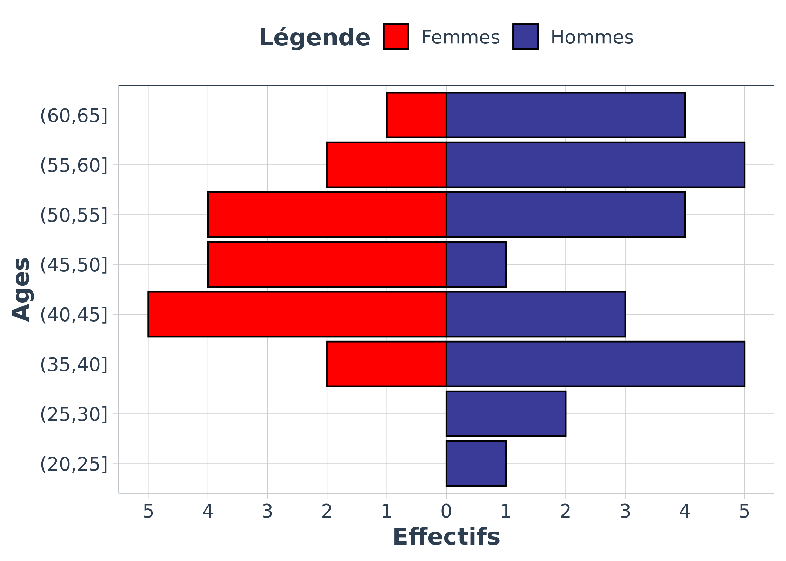
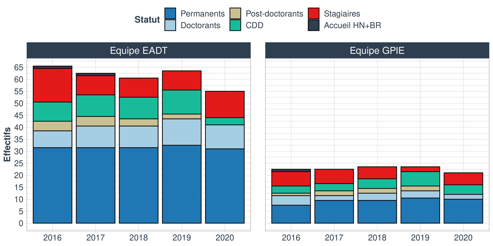
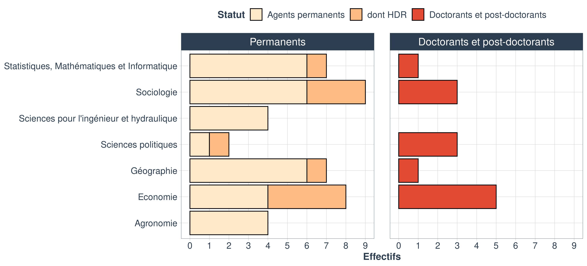

Traitement des données issues du document partagé pour l’Annexe 4
================

  - [Exploitation des données](#exploitation-des-données)
      - [Premiers indicateurs](#premiers-indicateurs)
          - [Projets](#projets)
          - [Production de connaissances](#production-de-connaissances)
              - [Quantification de la
                production](#quantification-de-la-production)
              - [Revues scientifiques](#revues-scientifiques)
              - [Nombre de citations](#nombre-de-citations)
          - [Partenariats](#partenariats)
              - [Interdisciplinarité proche
                (interne)](#interdisciplinarité-proche-interne)
              - [Interdisciplinarité éloignée
                (externe)](#interdisciplinarité-éloignée-externe)
      - [Graphes supplémentaires (intro du
        rapport)](#graphes-supplémentaires-intro-du-rapport)
          - [Pyramide des âges](#pyramide-des-âges)
          - [RH](#rh)
          - [Ressources](#ressources)
          - [Profil de l’UR](#profil-de-lur)
          - [Profils individuels UR](#profils-individuels-ur)
      - [Reste à faire](#reste-à-faire)

# Exploitation des données

## Premiers indicateurs

### Projets

> **NB : Il y a un projet international (le seul) à la fin inconnue…
> Donc par défaut j’ai décidé la fin en 2024 pour ne pas changer la tête
> du graphique tout en conservant l’info qu’il y a un projet
> international.**

Nous pouvons dans un premier temps représenter graphiquement la
chronologie des contrats :

Et dénombrer le nombre de contrats pour lesquels ETBX est porteur ou
non, ainsi que les types de contrats :

| porteur     |  n |
| :---------- | -: |
| Porteur     | 51 |
| Non porteur | 29 |

| type          |  n |
| :------------ | -: |
| Européen      |  5 |
| International |  1 |
| National      | 52 |
| PIA           | 15 |
| R\&D          |  7 |

Nous pouvons aussi compter combien de contrats **commencent** chaque
année (NB: et qui sont encore en cours sur la période 2017-2020, les
contrats qui débutent avant 2017 mais qui ont pris fin avant 2017 ne
sont pas comptabilisés).

| type          | 2013 | 2014 | 2015 | 2016 | 2017 | 2018 | 2019 |
| :------------ | ---: | ---: | ---: | ---: | ---: | ---: | ---: |
| Européen      |    0 |    0 |    0 |    1 |    1 |    3 |    0 |
| International |    0 |    0 |    0 |    0 |    0 |    0 |    1 |
| National      |    4 |    2 |    7 |   14 |    8 |    6 |   11 |
| PIA           |    0 |    0 |    2 |    1 |    2 |    2 |    8 |
| R\&D          |    0 |    0 |    2 |    0 |    2 |    0 |    3 |

Et combien **finissent** chaque année, à partir de 2017 :

| type          | 2017 | 2018 | 2019 | 2020 | 2021 | 2022 | 2023 | 2024 | 2025 |
| :------------ | ---: | ---: | ---: | ---: | ---: | ---: | ---: | ---: | ---: |
| Européen      |    0 |    0 |    3 |    1 |    0 |    1 |    0 |    0 |    0 |
| International |    0 |    0 |    0 |    0 |    0 |    0 |    1 |    0 |    0 |
| National      |    4 |    6 |   11 |    9 |    8 |    8 |    3 |    1 |    2 |
| PIA           |    0 |    0 |    6 |    5 |    3 |    1 |    0 |    0 |    0 |
| R\&D          |    0 |    2 |    2 |    0 |    2 |    0 |    0 |    1 |    0 |

Nous pouvons enfin quantifier, chaque année, combien de projets sont
**en cours** (NB: Pour les années antérieures à 2017, seuls les contrats
prenant fin à partir de 2017 sont comptabilisés).

| type          | 2014 | 2015 | 2016 | 2017 | 2018 | 2019 | 2020 |
| :------------ | ---: | ---: | ---: | ---: | ---: | ---: | ---: |
| Européen      |    0 |    0 |    1 |    2 |    5 |    5 |    2 |
| International |    0 |    0 |    0 |    0 |    0 |    1 |    1 |
| National      |    6 |   13 |   27 |   35 |   37 |   42 |   31 |
| PIA           |    0 |    2 |    3 |    5 |    7 |   15 |    9 |
| R\&D          |    0 |    2 |    2 |    4 |    4 |    5 |    3 |

### Production de connaissances

#### Quantification de la production

Nous étudions dans un premier temps le nombre d’articles, d’actes de
colloques et de chapitres d’ouvrages publiés par des agents de l’unité.

| Type               | 2017 | 2018 | 2019 | 2020 |
| :----------------- | ---: | ---: | ---: | ---: |
| Articles           |   41 |   30 |   28 |   26 |
| Autres articles    |    6 |    3 |    2 |    2 |
| Actes colloques    |   13 |   14 |   18 |    1 |
| Chapitres ouvrages |    6 |   14 |    5 |   15 |

Production en langue anglaise : **68** articles scientifiques et **11**
chapitres d’ouvrages.

#### Revues scientifiques

En ce qui concerne les revues, voici un nuage des revues auxquelles sont
soumis les articles scientifiques :

Nous pouvons ensuite observer si notre unité est bien identifiée dans
les revues dans lesquelles elle publie :

Nous pouvons représenter ces deux variables (nombre de publications /
nombre de relectures) sur un même graphique. Dans un soucis de
lisibilité, nous ne conservons que les revues pour lesquelles la
différence entre les deux variables est supérieure à 1.

Tableau des 10 avec le plus grand nombre de publi :

| revue\_ouvrage                                                     | n\_relecture | n\_publi |
| :----------------------------------------------------------------- | -----------: | -------: |
| journal of water resources planning and management                 |           29 |       10 |
| journal of hydroinformatics, iwa                                   |           10 |        0 |
| social indicators research                                         |            8 |        1 |
| water resources research, agu                                      |            5 |        0 |
| water science and technology: water supply, iwa                    |            5 |        0 |
| agricultural water management                                      |            4 |        0 |
| environmental science and policy                                   |            4 |        4 |
| silva fennica                                                      |            4 |        0 |
| water                                                              |            4 |        2 |
| développement durable et territoires                               |            3 |        4 |
| urban water journal                                                |            3 |        2 |
| conservation                                                       |            2 |        0 |
| dwes, drinking water engineering and science                       |            2 |        0 |
| journal of choice modelling                                        |            2 |        0 |
| journal of irrigation and drainage engineering                     |            2 |        0 |
| water research, elsevier                                           |            2 |        0 |
| agricultural systems                                               |            1 |        0 |
| agronomie, environnement et sociétés                               |            1 |        2 |
| annals of forest science                                           |            1 |        0 |
| belgeo                                                             |            1 |        0 |
| climatic change                                                    |            1 |        0 |
| communication in statistics                                        |            1 |        0 |
| comptes rendus geoscience                                          |            1 |        0 |
| ddt                                                                |            1 |        0 |
| echogéo                                                            |            1 |        0 |
| ecological economics                                               |            1 |        1 |
| ecological indicators                                              |            1 |        1 |
| economie rurale                                                    |            1 |        1 |
| energy policy                                                      |            1 |        0 |
| environment modeling software, elsevier                            |            1 |        0 |
| environmental modelling and assessment                             |            1 |        0 |
| environmental pollution                                            |            1 |        0 |
| environmental science and pollution research                       |            1 |        2 |
| etudes rurales                                                     |            1 |        0 |
| european review of agricultural economics                          |            1 |        0 |
| flux : cahiers scientifiques internationaux réseaux et territoires |            1 |        0 |
| forest policy and economics                                        |            1 |        4 |
| journal de la société française de statistique                     |            1 |        0 |
| journal of choice modeling                                         |            1 |        0 |
| journal of environmental economics and policy                      |            1 |        0 |
| journal of environmental management                                |            1 |        1 |
| journal of environmental policy & planning                         |            1 |        0 |
| journal of outdoor récréation and nature tourism                   |            1 |        0 |
| journal of water resource and protection natural resources         |            1 |        0 |
| land use policy                                                    |            1 |        5 |
| landscape and urban planning                                       |            1 |        0 |
| les cahier scicenifiques du parc national de port cros             |            1 |        0 |
| natures sciences sociétés                                          |            1 |        5 |
| norois                                                             |            1 |        0 |
| nss                                                                |            1 |        0 |
| ocean and coastal management                                       |            1 |        0 |
| ouvrage “débattre du paysage”                                      |            1 |        0 |
| politique européenne                                               |            1 |        1 |
| revue d’anthropologie des connaissances                            |            1 |        1 |
| revue d’economie régionale et urbaine                              |            1 |        0 |
| revue economique                                                   |            1 |        1 |
| revue internationale des etudes du développement                   |            1 |        0 |
| revue internationale des études du développement                   |            1 |        1 |
| river research and applications                                    |            1 |        0 |
| small-scale forestry                                               |            1 |        0 |
| sud-ouest europeen                                                 |            1 |        6 |
| vertigo                                                            |            1 |        5 |
| vertigo - la revue électronique en sciences de l’environnement 1   |            1 |        0 |
| water and environment journal                                      |            1 |        0 |
| water research                                                     |            1 |        0 |
| water resources and economics                                      |            1 |        2 |
| cahiers agriculture                                                |            0 |        3 |
| cahiers d’études du ghff                                           |            0 |        1 |
| cahiers de géographie du québec                                    |            0 |        1 |
| canadian journal of regional science                               |            0 |        1 |
| climate policy                                                     |            0 |        2 |
| computational statistics                                           |            0 |        1 |
| drinking water engineering and science                             |            0 |        1 |
| energy economics                                                   |            0 |        1 |
| environment and history                                            |            0 |        1 |
| environmental management                                           |            0 |        1 |
| espace géographique                                                |            0 |        1 |
| espacestemps.net                                                   |            0 |        1 |
| ethique et economie                                                |            0 |        1 |
| ethnographiques.org                                                |            0 |        1 |
| european water                                                     |            0 |        1 |
| food policy                                                        |            0 |        1 |
| geoforum                                                           |            0 |        1 |
| géographie, economie, société                                      |            0 |        3 |
| h2open journal iwa publishing                                      |            0 |        1 |
| international forestry review                                      |            0 |        1 |
| international journal of environmental technology and management   |            0 |        1 |
| international journal of geomatics                                 |            0 |        1 |
| journal for the history of environment and society                 |            0 |        1 |
| journal of coastal research                                        |            0 |        1 |
| journal of environmental planning and management                   |            0 |        1 |
| journal of hydraulic engineering                                   |            0 |        1 |
| journal of hydroinformatics                                        |            0 |        1 |
| journal of modern project management                               |            0 |        1 |
| journal of rural studies                                           |            0 |        1 |
| journal of urban research                                          |            0 |        1 |
| journal of water supply                                            |            0 |        2 |
| journal of wine economics                                          |            0 |        1 |
| loisir et société                                                  |            0 |        1 |
| outlook on agriculture                                             |            0 |        1 |
| pacific journal of mathematics for industry                        |            0 |        1 |
| participations                                                     |            0 |        1 |
| policy sciences                                                    |            0 |        1 |
| procedia engineering                                               |            0 |        2 |
| projets de paysages                                                |            0 |        1 |
| regards sociologiques                                              |            0 |        1 |
| région et développement                                            |            0 |        1 |
| regional environmental change                                      |            0 |        1 |
| revue de l’ofce                                                    |            0 |        1 |
| revue forestière française                                         |            0 |        2 |
| revue française d’economie                                         |            0 |        2 |
| scientific reports of port-cros national park                      |            0 |        1 |
| sociologia ruralis                                                 |            0 |        1 |
| sociologies                                                        |            0 |        1 |
| sociologies pratiques                                              |            0 |        1 |
| stochastic environmental research and risk assessment              |            0 |        1 |
| technology and culture                                             |            0 |        1 |
| water economics and policy                                         |            0 |        1 |
| water science and technology                                       |            0 |        2 |
| water utility journal                                              |            0 |        1 |
| wires water                                                        |            0 |        1 |

#### Nombre de citations

L’information du nombre de citations n’est évidemment pas indiqué dans
le document excel.

Il est cependant possible de récupérer cette information via le portail
HAL-INRAE. Ceci implique de travailler, forcément, avec un nombre réduit
de publications par rapport au document excel.

Un export de la base HAL a donc été réalisé avec ces deux critères :

  - Année 2017-2020

  - Unité = ETBX

A partir de cet export HAL-INRAE, nous récupérons 90 DOI, que nous
utilisons pour extraire sur scopus le nombre de citations pour chacun de
ces documents.

Cette requête a permis de récupérer des données de citations pour **52**
articles. Voici donc, à ce jour, le nombre de citations pour ces
articles en fonction de leur année de publication :

| Année | n\_citations |
| ----: | -----------: |
|  2017 |           78 |
|  2018 |           93 |
|  2019 |           20 |
|  2020 |            8 |

### Partenariats

#### Interdisciplinarité proche (interne)

A partir du tableau rempli par l’équipe du GT4, nous pouvons créer une
liste de noms d’auteurs (prenant en compte toutes les syntaxes possibles
d’un même nom) appartenant à ETBX.

Chacun des agents ETBX a aussi été affecté à une discipline, en accord
avec les informations présentées sur le site web de l’unité
<https://www6.bordeaux-aquitaine.inrae.fr/etbx/Les-equipes>.

(Fichier : `table_auteurs_ETBX_2020-08-17_BH.xlsx`).

Nous pouvons donc quantifier le nombre d’auteurs ETBX pour chaque
production scientifique (comprenant les articles scientifiques et les
chapitres d’ouvrages) :

| Nombre de co-auteurs ETBX sur une production scientifique | Fréquence |
| --------------------------------------------------------: | --------: |
|                                                         2 |        38 |
|                                                         3 |        18 |
|                                                         4 |         7 |
|                                                         5 |         4 |
|                                                         6 |         2 |

Avec l’information du nombre de co-auteurs, nous pouvons corriger le
nuage de revues précédent en le pondérant par le nombre moyen de
co-auteurs ETBX par publication pour chaque revue.

Grâce à la classification JCR (<https://jcr.clarivate.com>) nous pouvons
classer les revues selon des grandes catégories disciplinaires. Ci
dessous un tableau des 48 revues pour lesquelles une correspondance de
catégorie a pu être récupérée.

Voici donc le résumé du nombre de publications par catégorie JCR :

Nous pouvons maintenant nous intéresser aux disciplines. Nous pouvons
dénombrer le nombre de disciplines mobilisées pour chaque production
scientifique (comprenant les articles scientifiques et les chapitres
d’ouvrages) :

| Nombre de disciplines impliquées sur une production scientifique | Fréquence |
| ---------------------------------------------------------------: | --------: |
|                                                                2 |        35 |
|                                                                3 |         5 |
|                                                                4 |         2 |

Autre indicateurs:

  - Il y a **27** publications avec \> 2 agents ETBX mais où ces agents
    sont de la **même discipline**.
  - Il y a **68** publications où **un seul** agent ETBX est impliqué.

#### Interdisciplinarité éloignée (externe)

Cette section nécessite de disposer d’informations sur les affiliations
des co-auteurs. Cette information n’est malheureusement pas accessible
directement via le tableau excel (stratus) rempli par les collègues.

Il est cependant possible de récupérer une partie de ces informations
via HAL-INRAE. Ceci implique de travailler, forcément, avec un nombre
réduit de publications.

Un export de la base HAL a été réalisé avec ces deux critères :

  - Année 2017-2020

  - Unité = ETBX

Et nous obtenons le nombre d’entrées suivant :

| Type      |   N |
| :-------- | --: |
| ART       | 118 |
| COMM      | 153 |
| COUV      |  28 |
| DOUV      |   1 |
| HDR       |   5 |
| LECTURE   |   1 |
| MEM       |   7 |
| OUV       |   6 |
| POSTER    |   4 |
| REPORT    |  25 |
| THESE     |   4 |
| UNDEFINED |   1 |

Sur les **146** entrées (Articles + Chapitres d’ouvrages) récupérées
dans la base HAL, nous obtenons **282** structures différentes avec
lesquelles ETBX co-publie des articles scientifiques ou des chapitres
d’ouvrages. A partir des données extraites de ces documents, un
premier travail de catégorisation manuelle de nos partenaires a été
entamé par le GT (B. Rulleau), mais ne donne pour le moment pas
suffisamment d’informations pour pousser l’analyse avec ces données.

(Fichier : `Structures_Collab.xlsx`).

Ci dessous les 10 pays avec lesquels nous collaborons avec le plus de
labos (ex : 12 labos UK, 9 labs allemands, etc.)

| pays |  n |
| :--- | -: |
| UK   | 12 |
| DE   |  9 |
| FI   |  8 |
| AT   |  6 |
| BE   |  6 |
| CA   |  6 |
| NL   |  6 |
| ZA   |  6 |
| IT   |  5 |
| RO   |  5 |

Ensuite, nous supposons que la possibilité d’attribuer un sigle à la
structure permettait d’identifier la plupart des gros labos avec
lesquels on travaille. Ainsi, on dénombre **203** sigles uniques de
labos avec lesquels nous co-publions.

Les structures avec lesquelles on co-publie majoritairement (n copubli
\>5)

| structure                                                                                        |   n |
| :----------------------------------------------------------------------------------------------- | --: |
| Institut national de recherche en sciences et technologies pour l’environnement et l’agriculture | 228 |
| Environnement, territoires et infrastructures                                                    | 146 |
| Centre National de la Recherche Scientifique                                                     |  52 |
| Institut National de Recherche pour l’Agriculture, l’Alimentation et l’Environnement             |  27 |
| AgroParisTech                                                                                    |  15 |
| Institut National de la Recherche Agronomique                                                    |  14 |
| Université de Bordeaux                                                                           |  14 |
| Centre de Coopération Internationale en Recherche Agronomique pour le Développement              |  10 |
| Institut national d’études supérieures agronomiques de Montpellier                               |  10 |
| École des hautes études en sciences sociales                                                     |   8 |
| Ecole Nationale Supérieure des Sciences Agronomiques de Bordeaux-Aquitaine                       |   8 |
| 3S Consult GmbH                                                                                  |   7 |
| École Nationale du Génie de l’Eau et de l’Environnement de Strasbourg                            |   7 |
| École des Ponts ParisTech                                                                        |   6 |
| Gestion Territoriale de l’Eau et de l’environnement                                              |   6 |
| Université de Montpellier                                                                        |   6 |
| Université Sciences et Technologies - Bordeaux 1                                                 |   6 |
| Université Toulouse - Jean Jaurès                                                                |   6 |
| University of Adelaide                                                                           |   6 |

## Graphes supplémentaires (intro du rapport)

### Pyramide des âges

### RH

### Ressources

### Profil de l’UR

### Profils individuels UR

## Reste à faire

  - [ ] Remplir le document word
  - [ ] Représentation ‘Réseau’ des collaborations (internes et
    externes) ?
